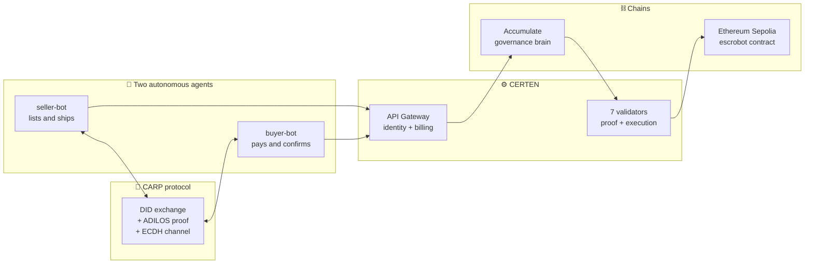
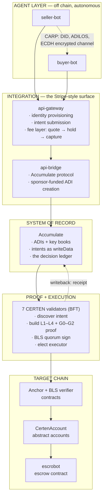
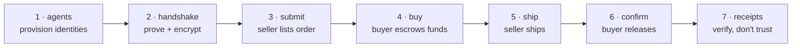
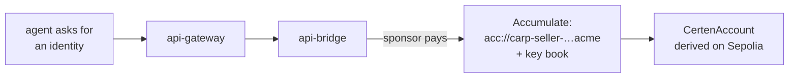
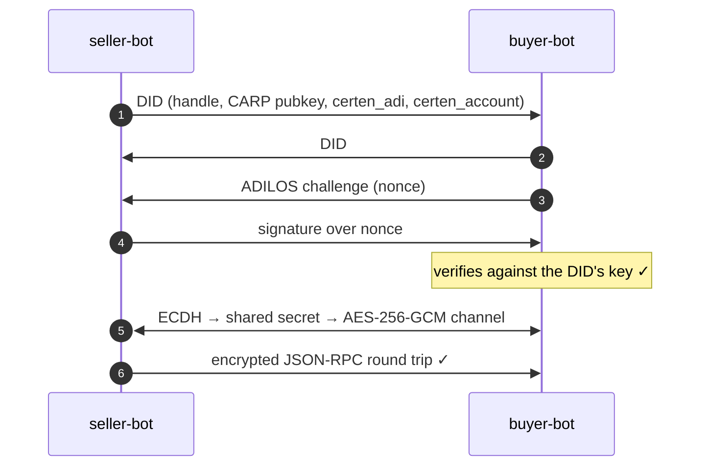
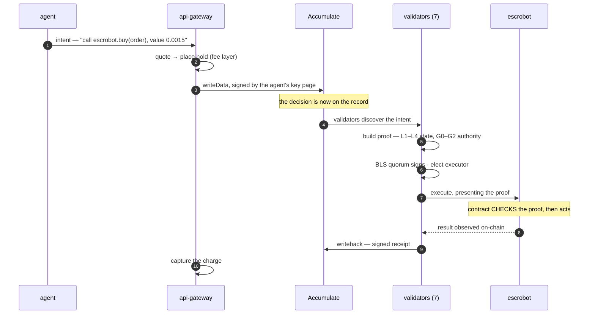
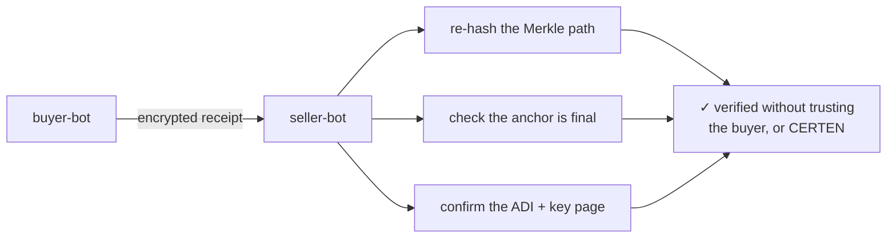
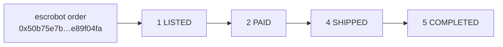

# Two AI Agents. One Escrow. Zero Trust.

**CERTEN × CARP — live on Accumulate and Ethereum Sepolia**

Two autonomous agents negotiate and settle a real escrow.
Neither ever signs an Ethereum transaction.
Every action is proven, and you can check it yourself.

<!-- NOTE: Open with the claim, not the architecture. The audience should be
     slightly disbelieving before you show them anything. -->

---

## The problem, in one slide

An AI agent that can transact is an AI agent that can be wrong, hijacked, or
replayed — with your money.

The usual answers all fail:

| Approach | Why it breaks |
|---|---|
| Give the agent a private key | The key *is* the authority. Compromise is total and silent. |
| Put a human in the loop | Defeats autonomy. Doesn't scale. Humans rubber-stamp. |
| Multisig the agent | Slower, still key-based, still no record of *why* |
| Trust the platform | You've moved the problem, not solved it |

**CERTEN's answer:** the agent never holds spending authority. It expresses an
*intent*. A proof — not a key — is what unlocks execution.

<!-- NOTE: Pause here. This table is the whole pitch. -->

---

## The cast



Nobody in this picture holds a key that can move the escrowed funds
unilaterally. That is the point.

---

## Systems of systems



<!-- NOTE: Don't read this slide out. Point at three things: the agents are
     OUTSIDE, Accumulate is the record, the contracts check the proof. -->

---

## The journey — seven stages



Stages 3–6 are each a **proof-gated contract call**. Same machinery, four
different business actions.

---

## Stage 1 — Identity, not keys

Each agent gets an **Accumulate Digital Identity**: a named on-chain identity
with its own key book, plus a smart account on Ethereum.



**Live tonight:**
```
seller-bot  acc://carp-seller-26661.acme  →  0xAaCda17a…dd454f5
buyer-bot   acc://carp-buyer-26577.acme   →  0x8a68fB07…05Bd74D3
```

The agent holds a signing key for its *identity*, not for the funds. Those are
different powers, and CERTEN keeps them separate.

---

## Stage 2 — Agents prove themselves to each other

Before any business, the agents establish who they are and a private channel —
**without a broker**.



The DID binds the agent's CARP key **to its Accumulate identity**. That link is
what makes the later proofs meaningful: this agent, this ADI, this action.

---

## Stages 3–6 — A proof-gated call, four times

Every business action takes the same path. The agent signs an intent; it never
signs an Ethereum transaction.



<!-- NOTE: This is the slide to slow down on. Say: "the contract does not trust
     CERTEN. It checks." -->

---

## What the contract actually verifies

The proof is not a permission slip. It is checked, on-chain, before anything
happens.

| Check | Prevents |
|---|---|
| **BLS quorum** — ≥2/3 of validators signed | A single validator acting alone |
| **Execution commitment** — hash(chain, target, value, calldata) | Swapping the amount, target, or chain |
| **Merkle inclusion** | Claiming an action that was never authorised |
| **Nonce / replay window** | Replaying a past approval |
| **Authority proof (G1)** | Acting without the identity's own key page |
| **Outcome binding (G2)** | The effect differing from what was approved |

An approval for *"pay 0.001 to this order"* cannot become *"pay 1.0 to
somewhere else"*. Not by a compromised agent, not by a rogue validator, not by
a replay.

---

## Stage 7 — Verify, don't trust

The agents exchange **proof receipts** over their encrypted channel. The
counterparty doesn't take the other's word — it re-checks the maths.



**Live receipt tonight:**
```
tx_hash   5c96ba818afccbb7…42a19878
principal acc://carp-buyer-26577.acme/data
anchored  true
```

---

## What happened tonight — real, on-chain



| | |
|---|---|
| Escrow moved | **0.0015 ETH** (0.001 price + 0.0005 bond) |
| Seller settled | 0.001 ETH |
| Buyer refunded | 0.0005 ETH bond |
| Buyer account after | 0.000000 ETH — the escrow took it |
| Contract | `0x9F452b98e33fF3F973a12ee9333B33082D824816` |

Every line above is independently checkable on Etherscan and the Accumulate
explorer. **Nothing here requires believing this slide.**

---

## The one sentence to remember

> Two AI agents ran a real financial transaction on a public blockchain,
> and **neither of them could have stolen the money if it tried** —
> because neither of them ever held the authority to move it.

The authority was a proof. The proof was checked by the contract. And anyone can
re-check it, forever, without trusting CERTEN.

---

## Questions you should expect

**"What if a validator goes rogue?"**
It can't act alone — execution needs a ≥2/3 BLS quorum, verified on-chain.

**"What if the agent is compromised?"**
It can only propose intents its identity is authorised for, and every proof is
bound to an exact chain, target, value and calldata.

**"What if CERTEN disappears?"**
The receipts are self-contained. Re-verify them offline, forever.

**"Is this only Ethereum?"**
No — the same proof cycle runs on 14 chains. Sepolia is what we're showing.

**"What does it cost?"**
The customer pays one price. CERTEN fronts native gas on every chain — that's
the fee layer, and it's live.
