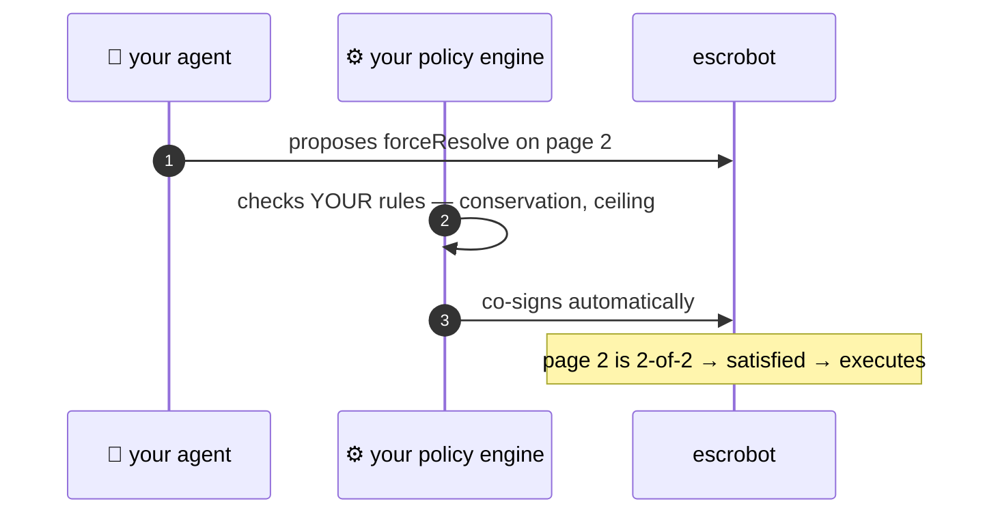

# The Admin Key Is Gone

**escrobot × CERTEN — live on Ethereum Sepolia**

> "My big concern is that centralized Admin function — anyone who looks at my
> escrow contract is going to see that and look at the forceResolve logic and
> realize **it isn't entirely automable**, and so they won't trust it for any
> real business use."

| We did NOT change | |
|---|---|
| The escrow contract | **Untouched** — same bytecode, same address |
| `forceResolve` logic | **Untouched** — same conservation check, same payouts |
| `isAdmin` | **Untouched** |
| The `admin` address | ← the only thing that moved |

```
escrobot.admin()  =  0x895b28715FA81F6F4d6994cDda4e5323cC07F9f3   = the panel
```

Your contract sees one address. Behind it is a panel with two levels of
authority — and you are only on the upper one.

---

# The shape: routine below, you above

```
acc://panel.acme/book                    ← escrobot's admin authority
  page/1   HIGHER priority   you                    escalation only
  page/2   lower  priority   agent + policy (2-of-2) routine settlement
```

Accumulate authorizes at **book** level, so either page can act for the contract
— each satisfying its own threshold. Two properties follow, and both are
enforced by the protocol rather than by us:

- **Page 2 settles on its own.** Routine disputes never reach you.
- **Page 1 can rewrite page 2; page 2 cannot touch page 1.** A page may only be
  modified by one of equal or higher priority. If an automated seat misbehaves,
  you replace it from above — and it can never replace you.

> "There's no profit in being Admin so **automating Admin as much as possible is
> desirable**… I'm willing to check in every day or two."
>
> You are not in the routine path at all. Checking in every day or two is the
> right cadence because the only things waiting are the genuinely unresolvable
> ones.

---

# Routine — settled without you



The third seat is not a person. It is a signer running **your** policy engine,
on **your** infrastructure, holding **its own key**. CERTEN cannot make it sign.

| Scene | Your engine | Result |
|---|---|---|
| **Routine** — split within policy | `approve` | Settles. **You are never told.** |
| **Out of policy** — one side takes the other's bond | `pending` | Stops, and comes to you |
| **Engine offline** | *no answer* | Stops. Silence is not consent |

> approve ▸ signs · **no answer ▸ signs nothing**
> *"An outage can never become an approval. That is a property of the code, not a setting."*

**Proven live:** order `0x7ba2eab4…` → status **5**, signed by `agent` and
`policy` **both on page 2**. Your seat was never asked.

---

# Escalation — the only time you appear

The automated seats could not settle it, so page 2 never reached its threshold
and nothing happened. One signature from you finishes it.

```bash
certen-approve list        # what is waiting, and why it stopped
certen-approve sign <tx>   # your seat, your passphrase, one signature
```

Your key is **encrypted at rest** and decrypted only for the moment of signing.
No daemon holds it: nothing can sign for you while you are away — which is the
entire point of an escalation seat.

**Proven live:** order `0xf62eefea…` → status **5**. The signature record shows
exactly what happened:

```
signed: you   on acc://panel.acme/book/1     ← 1-of-1, satisfies the book alone
signed: agent on acc://panel.acme/book/2     ← 1 of the 2 page 2 needed
```

Page 2 had **half** of what it needed and could never finish. Your single
signature on page 1 completed it.

---

# What this is, and what it isn't

**Is:** escrobot on Sepolia with a live two-page CERTEN panel as admin · routine
disputes settled by automated seats you control · escalation by one signature
from a key only you hold · a policy engine that fails closed · membership
recoverable from above. Every claim re-checkable on Etherscan.

**Isn't:** on mainnet · a revenue mechanism inside the escrow. `forceResolve`
enforces `amtToSeller + amtToBuyer == price + bond`, so arbitration cannot pay
your agent a cut without changing your contract — and we said we wouldn't.

**One property to weigh deliberately.** Page 2 acting alone means two compromised
automated seats could settle a routine dispute without you. The guards are your
own policy rules and your power to rewrite page 2 from above — not a signature
requirement. That is the deliberate trade for keeping you out of the routine
path, and it is yours to set: raise page 2's threshold, or narrow what its rules
permit.

```solidity
// this requires an agent and/or human to monitor a channel for arbitration
// requests and act promptly and in good faith
```

You wrote that as a caveat. The agent monitors, your policy engine decides, and
you appear only when they genuinely cannot — with **"in good faith" enforced by
a quorum and sealed in a proof**, rather than assumed.
