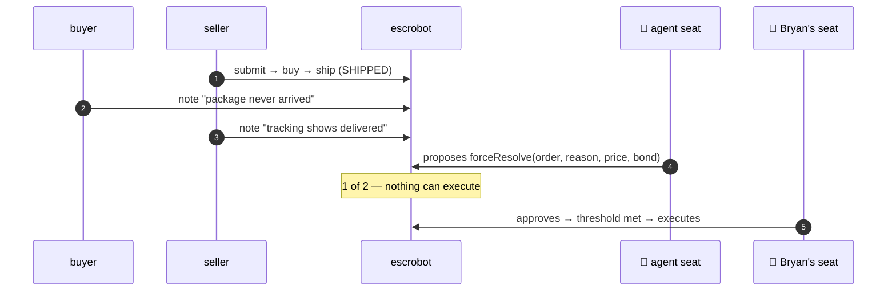

# The Admin Key Is Gone

**escrobot × CERTEN — live on Ethereum Sepolia**

> "My big concern is that centralized Admin function — anyone who looks at my
> escrow contract is going to see that and look at the forceResolve logic and
> realize **it isn't entirely automable**, and so they won't trust it for any
> real business use."

| We did NOT change | |
|---|---|
| The escrow contract | **Untouched** — same bytecode, same address |
| `forceResolve` logic | **Untouched** — same conservation check, same payouts |
| `isAdmin` | **Untouched** |
| The `admin` address | ← the only thing that moved |

```
escrobot.admin()  =  0x895b28715FA81F6F4d6994cDda4e5323cC07F9f3   = the panel
key page          =  2-of-2 {Bryan, his agent}
```

Seats are keys. Adding one later is adding a seat — no redeployment, no downtime.

---

# Act 1 — A disputed order, resolved by the panel



**The agent does the work. Bryan's signature is what finalizes it.**

| Order | `0xcad6e943…` | Buyer's complaint | `0x7f961765…` |
|---|---|---|---|
| **Resolution** | **`72ad64f8…`** | Seller's rebuttal | `0x338c0396…` |
| `Completed(order, …)` | **`0x895b2871…` = the panel** | Settled | seller 0.001 · buyer bond back |

Your own `require` enforced the payout; your own `note()` wrote the panel's
reason on chain, permanently. **Check `admin()` yourself on Etherscan.**

---

# Act 2 — Automating Admin

> "There's no profit in being Admin so **automating Admin as much as possible is
> desirable**… I'm willing to check in every day or two and just do the
> last-human-approval step."

The third seat is not a person. It is a signer running **your** policy engine, on
**your** infrastructure, holding **its own key**. CERTEN cannot make it sign.

| Scene | Your engine | Result |
|---|---|---|
| **Routine** — split within policy | `approve` | Signs itself. You click once. **Settled.** |
| **Out of policy** — one side takes the other's bond | `deny` | **Nothing settles** — though both humans signed |
| **Engine offline** | *no answer* | **Nothing settles.** Silence is not consent |

> approve ▸ signs · deny ▸ rejects · **no answer ▸ signs nothing**
> *"An outage can never become an approval. That is a property of the code, not a setting."*

**One catch worth knowing.** A contract call hides its amounts in ABI-encoded
calldata; the intent's *leg* value is `0`. So a ~40-line decoder is required
before your rules can see the payout at all — without it a full forfeiture sails
through. We found that the direct way.

---

# Act 3 — The threshold is the control

The panel voted a **regulator** in, live: `3-of-4 {policy, Bryan, agent, regulator}`.
No redeployment. No downtime. The contract never noticed.

A page threshold counts **how many** signatures, not **which**. That one number
governs both who settles a dispute and who changes the panel:

| Configuration | Who can resolve | Who can change membership |
|---|---|---|
| 3 seats, threshold 2 | any two — Bryan **not** required | any two |
| 3 seats, threshold 3 | all three — Bryan required | **all three** |
| 4 seats, threshold 3 | any three — Bryan **not** required | any three |

**And the automated seat must never rubber-stamp governance.** Auto-approving
membership changes would hand any two other seats the third signature for free —
quietly making governance 2-of-3 while resolution stayed 3-of-3. So it withholds:

```
PENDING  "updateKeyPage on …/book/1"  — awaiting operator release
APPROVE  — released by an operator          (page changes only now)
```

---

# What this is, and what it isn't

**Is:** escrobot on Sepolia with a live CERTEN panel as admin · disputes resolved
by proof-gated multi-party calls · membership self-governing · an automated seat
that obeys your rules and fails closed. All of it re-checkable on Etherscan
without trusting anything on this screen.

**Isn't:** on mainnet · tiered thresholds across multiple key pages · a revenue
mechanism inside the escrow. `forceResolve` enforces
`amtToSeller + amtToBuyer == price + bond`, so arbitration cannot pay your agent
a cut without changing your contract — and we said we wouldn't.

```solidity
// this requires an agent and/or human to monitor a channel for arbitration
// requests and act promptly and in good faith
```

You wrote that as a caveat. The agent monitors, your policy engine decides, you
confirm — and **"in good faith" is now enforced by a quorum and sealed in a
proof**, rather than assumed.
