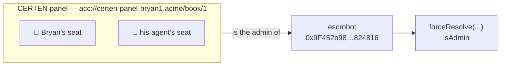
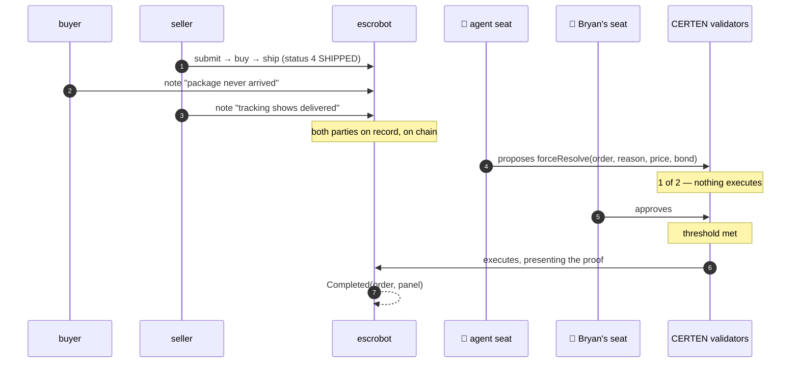
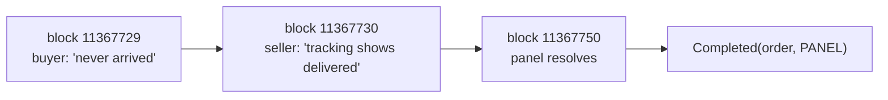
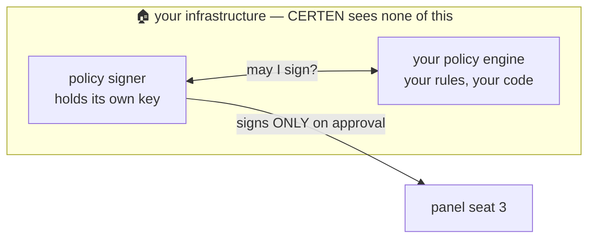
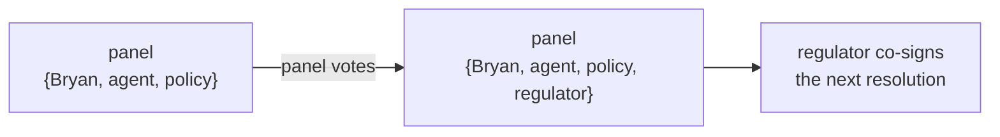

# The Admin Key Is Gone

**escrobot × CERTEN — live on Ethereum Sepolia**

Your escrow contract is unchanged.
`forceResolve` is exactly as you wrote it.
The only thing that changed is *who is allowed to call it*.

<!-- NOTE: Do not open with architecture. Open with his problem, in his words —
     the next slide. He should hear his own concern read back before he sees
     anything we built. -->

---

## Your concern, verbatim

> "My big concern is that centralized Admin function — anyone who looks at my
> escrow contract is going to see that and look at the forceResolve logic and
> realize **it isn't entirely automable**, and so they won't trust it for any
> real business use."

And from the contract itself, above `forceResolve`:

```solidity
// this requires an agent and/or human to monitor a channel for arbitration
// requests and act promptly and in good faith
```

**"In good faith" is an assumption.** Today it becomes something a counterparty
can check.

<!-- NOTE: Let the code comment land. He wrote it as a caveat. The whole demo is
     turning that caveat into a guarantee. Come back to it on the final slide. -->

---

## What we did NOT change

| | |
|---|---|
| The escrow contract | **Untouched.** Same bytecode, same address |
| `forceResolve` logic | **Untouched.** Same conservation check, same payouts |
| Who can call it | `isAdmin` — **also untouched** |
| The `admin` address | This is the only thing that moved |

`admin` used to be one person's key. It is now a CERTEN panel.

Anyone auditing your contract sees Admin is a multi-party body with rules,
rather than a single key that could walk away with the funds.

---

## The panel, on chain right now



```
escrobot.admin()  =  0x895b28715FA81F6F4d6994cDda4e5323cC07F9f3
                  =  the panel
key page          =  2-of-2 {Bryan, agent}
```

Seats are keys. Adding one later is adding a seat — no redeployment, no
downtime. **Check `admin()` yourself on Etherscan.**

---

## Act 1 — A disputed order, resolved by the panel



The agent does the work. **Bryan's signature is the one that finalizes it** —
which is exactly the "check in every day or two" model, not an approximation of it.

<!-- NOTE: Slow down on steps 5-7. Between them, nothing can happen. That gap IS
     the product. -->

---

## Act 1, as it actually ran — every line checkable



| | |
|---|---|
| Order | `0x77b8b764…c8e3` |
| Buyer's complaint | `0x68a70bae…6ccc` |
| Seller's rebuttal | `0x5ecbdca7…5620` |
| **The resolution** | **`0xe0e1233f…69da`** |
| `Completed(order, …)` | `0x895b2871…` — **the panel** |
| Seller settled | 0.001 ETH (the price) |
| Buyer settled | 0.0005 ETH (bond returned) |

On Accumulate, the same decision: WriteData `dafa54f7…`, **delivered with two
signatures** — the agent's (`bfec7219…`) opened it, Bryan's (`d7a0d860…`)
finalized it. Seven validators agreed; validator-6 executed.

```bash
cast call 0x9F452b98e33fF3F973a12ee9333B33082D824816 "status(bytes32)(uint8)" \
  0x77b8b764f4e4c0c5ce72c6b551b445bef8c3d2804365150dec5ff9b1bc66c8e3 \
  --rpc-url https://ethereum-sepolia-rpc.publicnode.com     # -> 5 (COMPLETED)
```

<!-- NOTE: Offer the command. Let someone in the room run it. Nothing here needs
     believing this slide. -->

---

## What the contract enforced, not us

```solidity
require(orders[_orderId].status == State.SHIPPED, "must be SHIPPED to arbitrate");
require(amtToSeller + amtToBuyer == price + bond,  "payout exceeds order");
note(_orderId, _reason);          // the panel's rationale, on chain, forever
emit Completed(_orderId, msg.sender);   // msg.sender is the PANEL
```

| Guarantee | Enforced by |
|---|---|
| Payout can't exceed the escrow | **Your `require`** |
| Only Admin may arbitrate | **Your `isAdmin`** |
| Admin is now multi-party | The panel's key page threshold |
| The exact split can't be altered | Sealed into the CERTEN proof |
| The reason is public and permanent | **Your `note()`** |

A compromised seat cannot change who gets paid. It can only fail to agree.

---

## Act 2 — Automating Admin

> "There's no profit in being Admin so **automating Admin as much as possible is
> desirable**. If my agent is making money helping other agents and humans
> through the escrow process then I'm willing to check in every day or two and
> just do the last-human-approval step."

So the third seat is not a person.



The key is generated and held by you. **CERTEN cannot make it sign.** Only your
engine's approval can.

---

## Three scenes, and the third is the important one

| Scene | Your engine says | What happens |
|---|---|---|
| **Routine** — split within policy | `approve` | Signs automatically. Bryan taps once. Resolved. |
| **Out of policy** — one side gets the other's bond | `deny` | **Nothing settles.** Even though both humans want it to. |
| **Engine offline** | *nothing* | **Nothing settles.** Silence is not consent. |

From the signer's own documentation:

> approve ▸ signs · deny ▸ rejects · **no answer ▸ signs nothing**
> "An outage can never become an approval. That is a property of the code, not a
> setting."

<!-- NOTE: Scene 3 is the one that wins the room. Kill the policy engine live and
     show the resolution simply not happening. A demo of something NOT happening
     is unusual and it sticks. -->

---

## Before rules can work, the engine has to see the numbers

A contract call carries its amounts inside ABI-encoded `callData`. The intent's
*leg* value is `0` — the panel calls a function, it doesn't send ether. So a
policy engine reading the leg sees **nothing to gate on** and approves anything.

```js
// escrobot-decoder.mjs — ~40 lines, no dependencies, no fork of the signer
if (!callData.startsWith('e17a9e7b')) return undefined;   // not forceResolve? decline
return { summary: {
  action: `arbitration on ${orderId} — ${amtToSeller} to seller, ${amtToBuyer} to buyer`,
  values: [String(amtToSeller), String(amtToBuyer)],      // ← what gets gated
}};
```

Now the engine reads a sentence:

> *"escrobot arbitration on order 0xfd988283… — 1500000000000000 wei to seller,
> 0 wei to buyer — 'seller awarded price AND buyer bond (full forfeiture)'"*

**We learned this the direct way.** Before the decoder existed, a full forfeiture
passed the gate and settled on Sepolia, because the rules were reading a zero
instead of the payout. The rules were fine. They were looking at the wrong thing.

<!-- NOTE: Do not skip this slide to look cleaner. An engineer in the room will
     immediately wonder how the engine sees inside a contract call, and having
     already answered it — including how we found out — buys more credibility
     than a flawless story would. -->

---

## The rules in Act 2 are yours, and they're readable

```js
// 1. CONSERVATION — the payout must equal price + bond exactly
if (total !== escrowed) return deny(`payout ${total} != ${escrowed} escrowed`);

// 2. CEILING — no side is automatically awarded more than the price.
//    A forfeiture of the other party's bond is a HUMAN decision.
if (n > CEILING) return deny(`${n} exceeds the auto-approval ceiling; escalate`);
```

That second rule is the interesting one. Conservation alone would happily approve
"give the seller everything including the buyer's bond" — the totals still
balance. **The ceiling is what makes a forfeiture require a person.**

---

## Act 3 — Making it official

> "The panel also needs to be able to change the panel membership in the future,
> who knows maybe to include **a financial regulator agent**."
>
> "Post-integration, I'd like us to find a way to make our combined system
> official/approved/qualified/useful for some real-world ecommerce."



Changing membership **is itself a panel decision** — the same mechanism that runs
a resolution. No redeployment. No downtime. The contract never notices.

Live today, after the panel voted:
```
key page = 3-of-4 {policy, bryan, agent, regulator}
```

And the regulator can **witness and refuse** — but cannot redirect a single wei.
The split is sealed in the proof and conservation is enforced by your own
`require`.

One thing to notice on that line, though: at **3-of-4**, Bryan is no longer
structurally required. Adding a seat changed who is necessary. Next slide.

---

## Two honest limitations

**1. A threshold counts how many signatures, not which ones.**

| Configuration | Consequence |
|---|---|
| 3 seats, threshold 2 | agent + policy engine could resolve **without Bryan** |
| 3 seats, threshold 3 | Bryan structurally required — any absent seat blocks everything |
| 4 seats, threshold 3 | Bryan **not** required again — adding the regulator changed this |

Adding a seat silently changes who is necessary. That's a decision to make
deliberately each time, not a detail.

**2. A mandatory automated seat can veto its own removal.**

At 3-of-3 the policy engine is required for *everything* — including changing
membership. Ours denied a legitimate membership change, because it had no rule
for governance and correctly refused what it couldn't price.

> A panel whose automated seat is misconfigured can neither resolve disputes nor
> rotate the broken seat out. It is bricked.

Fixed by giving the engine an explicit governance rule. But the deeper fix is
**multiple key pages at different thresholds** — routine disputes cleared by the
automated seats, larger ones requiring the human, and a break-glass path that
never depends on the automated seat. Not built. Not claimed.

<!-- NOTE: We found #2 by hitting it live, not by reasoning about it. Say that.
     Volunteering your own sharp edges is what makes everything else credible. -->

---

## Where the money question actually lands

`forceResolve` enforces `amtToSeller + amtToBuyer == price + bond`.

So **arbitration cannot pay your agent a cut** — not without changing your
contract, which we said we wouldn't do. Any revenue for the agent has to come
from the service layer (CARP, listing, matching), not from splitting escrowed
funds.

Worth being straight about, because the alternative is discovering it later.

---

## What this is, and what it isn't

**Is:** escrobot on Sepolia with a live CERTEN panel as admin; disputes resolved
by multi-party proof-gated calls; membership self-governing; an automated seat
that obeys your rules and fails closed.

**Isn't:** on mainnet; a tiered-threshold design; a revenue mechanism inside the
escrow contract.

Everything shown is checkable on Etherscan and the Accumulate explorer without
trusting anything on this screen.

---

## The one sentence

> Your contract used to have a key that could run off with the funds.
> Now it has a panel that can't — and you still only click once.

```solidity
// this requires an agent and/or human to monitor a channel for arbitration
// requests and act promptly and in good faith
```

You wrote that as a caveat. The agent monitors, your policy engine decides, you
confirm — and **"in good faith" is now enforced by a quorum and sealed in a
proof**, rather than assumed.
