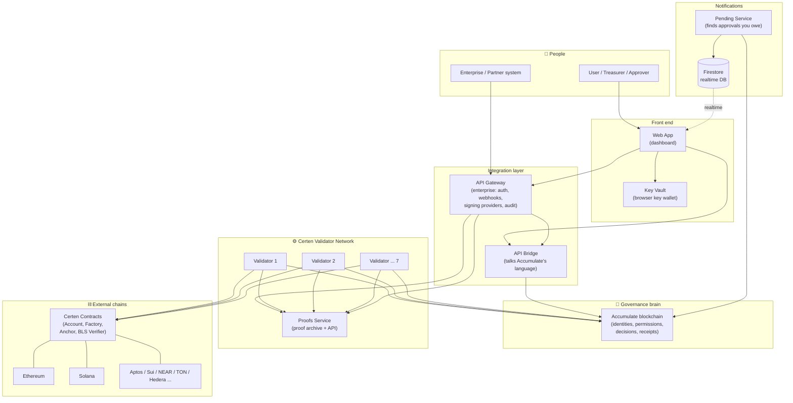
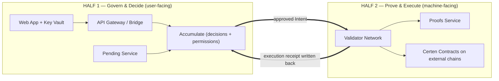
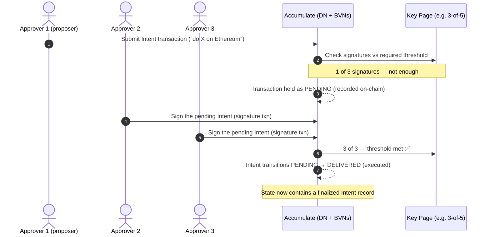
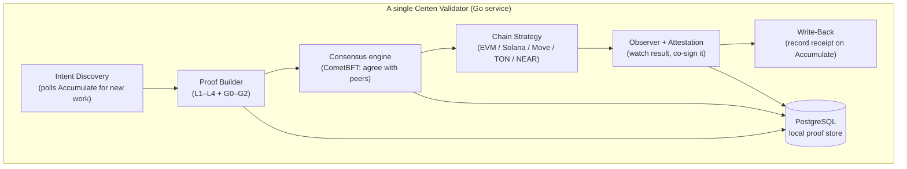
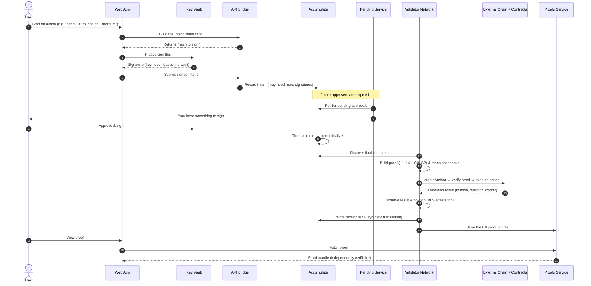
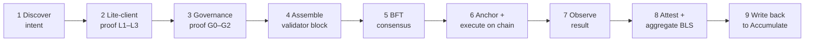
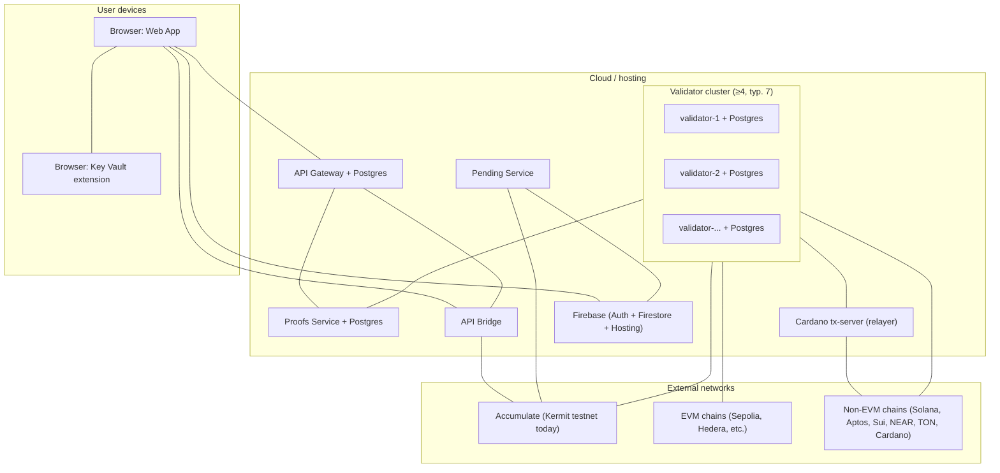
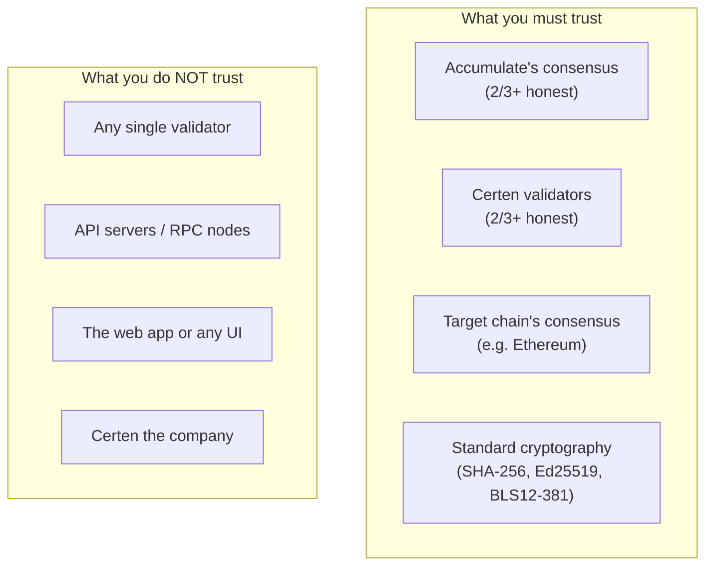

# 01 — Infrastructure & Workflow Diagrams

[← Back to index](./README.md)

This document is the **picture book**. If you only read one page, read this one.
Each diagram has a plain-English caption underneath.

---

## 1. The whole system on one page

**In words:** People use the **Web App** (signing with the **Key Vault**).
The app talks to Certen through the **API Gateway / Bridge**. Decisions land on
**Accumulate**. The **Validator Network** watches Accumulate, proves each
decision, and executes it on **external chains** via the **Certen Contracts**,
storing every proof in the **Proofs Service**. The **Pending Service** keeps
users informed about approvals they still owe.

---

## 2. The two "halves" of Certen

It helps to split Certen into two cooperating halves:

**In words:** Half 1 is about **deciding** (humans, identities, approvals) and
lives around Accumulate. Half 2 is about **proving & doing** (validators, math,
external chains). The bridge between them is the **Intent** going in and the
**receipt** coming back.

---

## 3. Before the validators: how an Intent is born on Accumulate

Everything in this guide *starts* with a finalized Intent sitting on Accumulate.
But where does that Intent come from, and how does it get approved? This all
happens on the **Accumulate** side, **before** any Certen validator is involved.

**1. Writing the Intent.** An Intent is just a **transaction on Accumulate**,
submitted to the organization's identity (its **ADI**, e.g. `acc://acme.acme`).
It says, in structured form, "perform *this* action on *this* chain." Nothing
leaves Accumulate yet — it's a request recorded in the governance brain.

**2. Who is allowed to approve it (thresholds).** Every ADI is governed by a
**Key Book**, and inside it a **Key Page** lists the authorized signing keys and
an **accept threshold** — the classic "**M of N**" rule (e.g. *3 of 5* treasury
officers). The threshold is the on-chain policy that says how many of the named
authority signers must agree before anything is allowed to happen.

**3. How multi-sig / pending transactions work.** If the first submission
doesn't already carry enough signatures to meet the threshold, Accumulate does
**not** reject it — it records the transaction in a **PENDING** state on-chain.
Each additional approver then sends a small **signature transaction** that
references the pending Intent's hash. Signatures accumulate over time (minutes,
hours, or days — whatever the approvers take). This is exactly what the
**Pending Service** later watches, so it can nudge "you still owe a signature."

**4. How Accumulate nodes process all this.** Accumulate is itself a
**BFT blockchain** (a Directory Network + sharded BVNs). Its validators order
and commit every one of these transactions — the original Intent and each
signature — into blocks. Each committed block updates Accumulate's
**app_hash / BPT root**, the one-number summary of all account state. So the
pending Intent, and every signature attached to it, are **permanently recorded**
as they arrive, not just at the end.

**5. What happens when the threshold is met.** The moment the accumulated
signatures from the authority signers reach the Key Page's threshold,
Accumulate transitions the transaction from **PENDING → DELIVERED**: it executes
and its effects are written into state. *Only now* does a **finalized, committed
Intent record** exist on Accumulate. That finalized record — bound to a specific
block and app_hash, approved by exactly the right key page — is precisely what a
Certen validator discovers in the next step and what its proofs later bind to.

> **The handoff:** Accumulate's job is to decide *correctly and provably*. By the
> time a Certen validator sees an Intent, the "who approved it, and were they
> allowed to" question is already settled and recorded on-chain. The validator
> network's job is to *prove that fact to other blockchains and carry out the
> action* — which is what the rest of this guide covers.

---

## 4. Inside one validator node

**In words:** Each node runs a small assembly line: **find** an approved intent →
**build** its proof → **agree** with the other validators → **execute** it on the
target chain → **watch and co-sign** the result → **write the receipt back** to
Accumulate. Everything is logged in the node's own database.

---

## 5. The end-to-end "happy path" (most important diagram)

This is the full life of one cross-chain action, from a person clicking
*Approve* to an independently verifiable receipt.

**In words:** A user authorizes an action; it gets the required approvals on
Accumulate; the validator network proves and executes it on the target chain,
co-signs the outcome, and records a receipt; the proof is archived and the user
can pull it up and verify it.

---

## 6. The validator's 9-phase pipeline (detail of step "Build proof & execute")

| Phase | What happens | Why it matters |
|---|---|---|
| 1 Discover | Node spots a finalized `CERTEN_INTENT` on Accumulate | The trigger for all work |
| 2 Lite-client proof (L1–L3) | Prove the account/state is real and was committed by Accumulate consensus | Ties the action to Accumulate's truth |
| 3 Governance proof (G0–G2) | Prove it was *included*, *authorized*, and the *outcome is bound* | Proves the right people approved it |
| 4 Assemble | Pack all proof pieces into one canonical "validator block" | One object to agree on |
| 5 Consensus | 2/3+ of validators sign the block | No single validator can cheat |
| 6 Anchor + execute | Call the on-chain contracts: record the anchor, verify the proof, perform the action | The action actually happens |
| 7 Observe | Watch the target chain until the transaction is confirmed | Confirms it really executed |
| 8 Attest + aggregate | Each validator co-signs the result; signatures combined via BLS + a ZK proof | A compact, verifiable group endorsement |
| 9 Write-back | Record the result receipt back on Accumulate | Closes the loop; permanent audit trail |

---

## 7. Deployment topology (where things physically run)

**In words:** The **validator cluster**, **proofs service**, **gateway**,
**bridge**, and **pending service** run as backend services (each with its own
database where needed). The **web app** is hosted on Firebase and runs in the
user's browser alongside the **Key Vault** extension. Everything connects out to
**Accumulate** and the **external chains**. Most chains are driven directly by
the validators; **Cardano** is the exception — because of its UTXO/Plutus model
the validators hand transactions to a small **Cardano tx-server (relayer)** that
builds and submits them, then reports the result back.

---

## 8. Trust & fault tolerance (why you can believe it)

**In words:** Security rests on **math** and on **supermajorities**, not on any
one company or server. If up to one-third of validators are malicious or broken,
the system still produces only correct, verifiable results. Anyone can re-check a
proof themselves — the UIs and servers are conveniences, not trust anchors.

---

Continue to **[02 — External Chains & Accumulate →](./02-external-chains-and-accumulate.md)**
