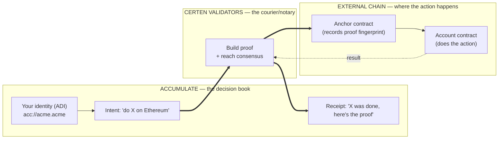
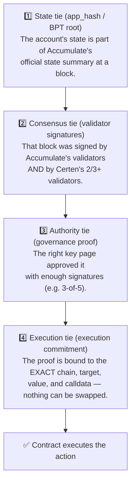
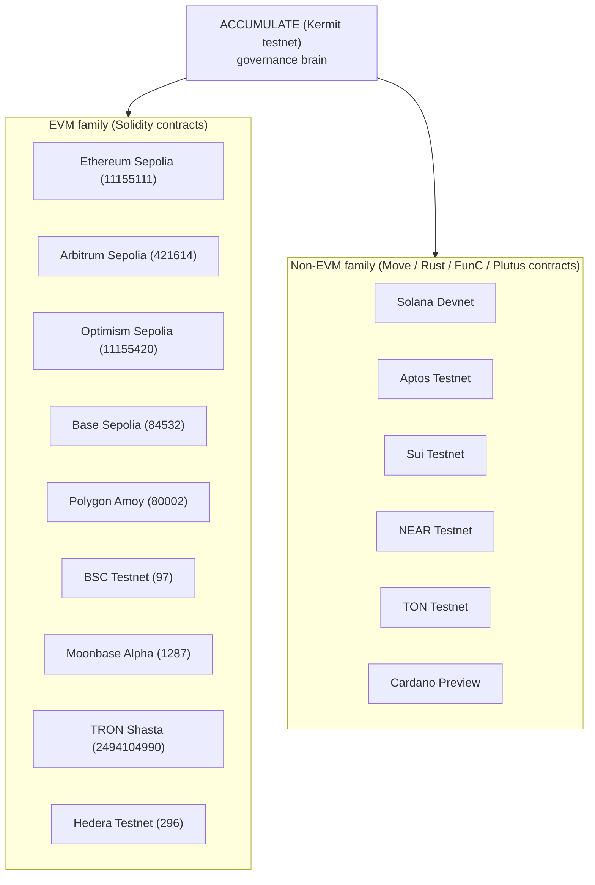
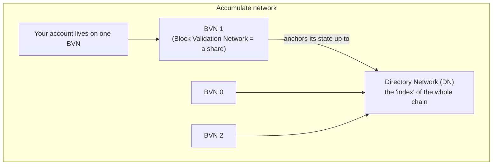

# 02 — External Chains & Their Relationship to Accumulate

[← Back to index](./README.md)

This document answers: **which blockchains does Certen touch, what are the
contract addresses, and how exactly do those external chains connect back to
Accumulate?**

---

## 1. The core relationship in one picture

**The key idea:** Accumulate is the **single source of authority**. An external
chain never decides anything on its own — it only acts when a Certen contract is
shown a **proof that an Accumulate decision authorized this exact action**. The
proof's fingerprint gets **anchored** on the external chain, and the result gets
**written back** to Accumulate. The two worlds are stitched together by the
validators and by the cryptographic proof.

---

## 2. How an Accumulate decision becomes an on-chain fact

There are four cryptographic "ties" that bind the two worlds together. Each one
is checked on-chain before any action runs:

Plain English:
- **State tie** — "this account really existed in this state on Accumulate."
- **Consensus tie** — "Accumulate and Certen's validators both vouched for it."
- **Authority tie** — "the people who were allowed to approve it, did."
- **Execution tie** — "this approval is for *this* action on *this* chain only"
  (so a proof for a $10 transfer can't be replayed as a $1M transfer, or reused
  on a different chain).

> The **execution tie** is one of Certen's most important security properties.
> Earlier contract versions could be tricked by swapping parameters; the current
> **V6.1** contracts bind the proof to six independent fields including the chain
> ID, the exact target/value/calldata, the intent's identity, and a snapshot of
> the validator set. See [06 — Contracts](./06-contracts-explained.md).

---

## 3. Which chains Certen supports

Certen runs against **Accumulate (Kermit testnet)** as the brain, and executes on
**15 external testnets** today — a mix of EVM and non-EVM:

**EVM chains** all share the same Solidity contracts (Account, Factory, Anchor,
BLS Verifier). **Non-EVM chains** have functionally-equivalent contracts written
in each chain's native language (Move for Aptos/Sui, Rust for Solana/NEAR, FunC
for TON, Plutus for Cardano). The validator talks to each family through a
pluggable "chain strategy."

> **Cardano uses a helper relayer.** Most chains are driven directly by the
> validators. Cardano's UTXO/Plutus model makes transactions awkward to build
> in-process, so Certen runs a small **Cardano tx-server** (a transaction-builder
> relayer) alongside the validators on the network's server. The validators tell
> it what to execute; it builds, submits, and reports back the result, which the
> validators then prove and write back to Accumulate like any other chain.

---

## 4. The current live addresses (testnet)

Every chain below runs the **current V6.1 ("A+++") contracts** — the anchor with
full security binding, the V6 account factory, and the V2 BLS verifier. There are
no legacy (V3/V4/V5) contracts in the live path.

### 4a. Ethereum Sepolia (chain 11155111) — the primary EVM testnet

| Contract | Address | Role |
|---|---|---|
| **Anchor V6.1** (active) | `0x14885Fe8b13605A01A9d62eB2dBf1bf3bB4ac368` | Current anchor with full security binding |
| BLS Verifier V2 — adapter | `0x8EEDa48f99709e90e30bE1510972b80163fd1aC7` | Entry point used by Anchor V6.1 |
| BLS Verifier V2 — generated | `0x54c644A1ed515f3cb2Fa02c23F2ba09C2003aF22` | The ZK (Groth16) verifier proper |
| Account Factory | `0x9a8e3df1Da609CC1e7A3fA8df2B623266A6d5Da3` | Creates user smart accounts |

### 4b. Other EVM testnets (Anchor V6.1 + Account Factory)

| Chain | Anchor V6.1 | Account Factory |
|---|---|---|
| Arbitrum Sepolia (421614) | `0xad81055b211c2d99672A1b8586Dba4317F8896Dd` | `0x479ECeEb94AD4f68628a4C19c5126c77fD350cB6` |
| Optimism Sepolia (11155420) | `0xC2494b9945460fEb6e02397156B6C3e2bccB7c81` | `0x479ECeEb94AD4f68628a4C19c5126c77fD350cB6` |
| Base Sepolia (84532) | `0xbEAA8aA739d291782Fc90af9eD247e2e4430eade` | `0x479ECeEb94AD4f68628a4C19c5126c77fD350cB6` |
| Polygon Amoy (80002) | `0x7a8c5DC01C2d2Ba498F76832dBcbf0Fe2f69a6C3` | `0x9a8e3df1Da609CC1e7A3fA8df2B623266A6d5Da3` |
| Moonbase Alpha (1287) | `0x0f7E55FD33D9f20fe0bd18d7bdB5F2EA8dDDf812` | `0x479ECeEb94AD4f68628a4C19c5126c77fD350cB6` |
| BSC Testnet (97) | `0x7a8c5DC01C2d2Ba498F76832dBcbf0Fe2f69a6C3` | `0x479ECeEb94AD4f68628a4C19c5126c77fD350cB6` |
| TRON Shasta (2494104990) | V6.1 _(deploying)_ | _(deploying)_ |
| **Hedera Testnet (296)** | `0xca67409d872B04cc2a13dEAb2eaa2AD070029F59` | `0x964B43aF4C894CC29FE79C38f55Ca9889B6252D3` |

> Hedera is fully upgraded to V6.1 with end-to-end value transfers verified.
> TRON Shasta is mid-upgrade to V6.1; its new addresses land this week.

### 4c. Non-EVM testnets

| Chain | Anchor | Account Factory |
|---|---|---|
| Solana Devnet | program `Bf9cZdQwvGgynBaJYQYdyWszZJQPR9TtZvu1ZNxR7JAu` | program `HYjh3ygUSFkd8EU8VrEbeKttCWSVxEsAT5zNqhBvS4BW` |
| Aptos Testnet | package `0x0d61023cca621d94f3b5a08421e2dff488897fd76691c53754d4ff457e5694d1` | (same package) |
| Sui Testnet | package `0x3914c9fc61bd7b78b96d93644641943296be530bc9cce51a436e5ead8fb20913` | object `0x36394f9d727832583bbfa131f2084ff5d7df736b6eef0b300d065d149364c1ed` |
| NEAR Testnet | `v6-1.certen-anchor-v5.testnet` | `v3.certen-factory-v2.testnet` |
| TON Testnet | `kQBgCKTdtxbMljgZT_ZlrD3k_gqmjZv7Q9tiPgGQEjizAulz` | `kQBIgMxleR_8S7j8gA1M_eSMw6As91hRAewZdxLthZLA5QnT` |
| Cardano Preview | `addr_test1wqqp0z9vxsus2940cfgd74d5027gtj9ta33y05z9vplyqfq5y08y7` | (via Cardano tx-server relayer) |

---

## 5. How Accumulate itself is structured (just enough to follow proofs)

- Accumulate is **sharded**: accounts live on a **BVN** (Block Validation
  Network). Each BVN periodically **anchors** its state into the **Directory
  Network (DN)**, the master index.
- Each block carries an **app_hash** (a.k.a. **BPT root**) — a single number
  summarizing all account states.
- A Certen proof walks this ladder: *your account → BVN block (app_hash) → DN →
  validator signatures*. That's what the **L1–L4 layers** in the next docs mean.

Certen's validator config points at the Kermit testnet's DN and BVN endpoints
(`ACCUMULATE_COMET_DN`, `ACCUMULATE_COMET_BVN…`) so it can read these blocks and
their signatures directly.

---

## 6. The Certen network's own Accumulate identity

The validator network operates under its **own** Accumulate identity, used to
write execution receipts back on-chain:

| Item | Value |
|---|---|
| Network ADI | `acc://certen-protocol.acme` |
| Key book / page | `acc://certen-protocol.acme/book` / `…/book/1` |
| Receipts data account | `acc://certen-protocol.acme/execution-results` |

When the validators finish executing an action (Phase 9), they write the result
and its proof summary into the `execution-results` data account — a permanent,
queryable audit trail on Accumulate itself.

---

Continue to **[03 — End-to-End Workflows →](./03-end-to-end-workflows.md)**
