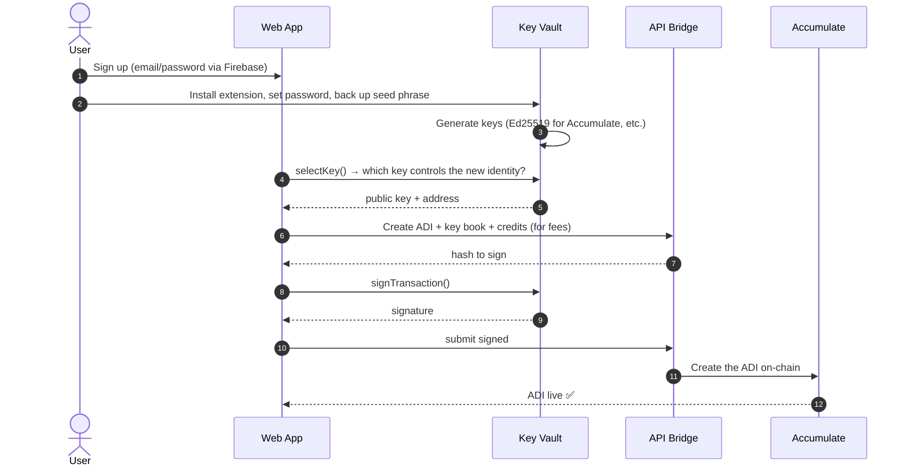
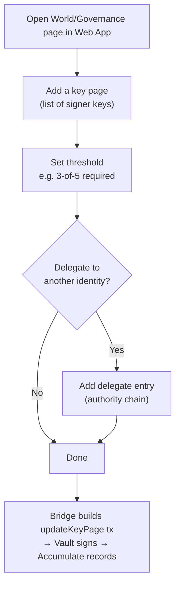
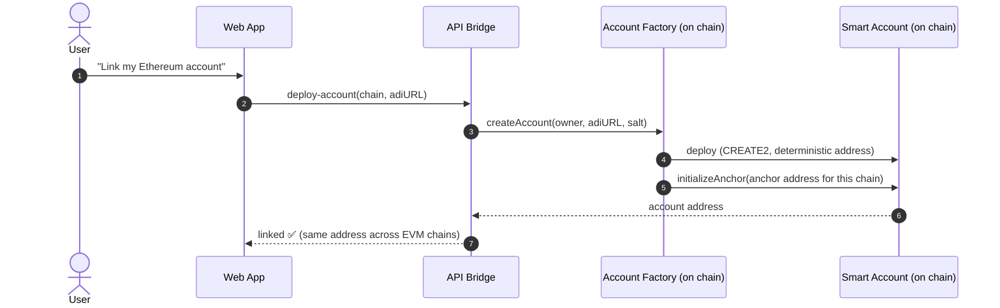
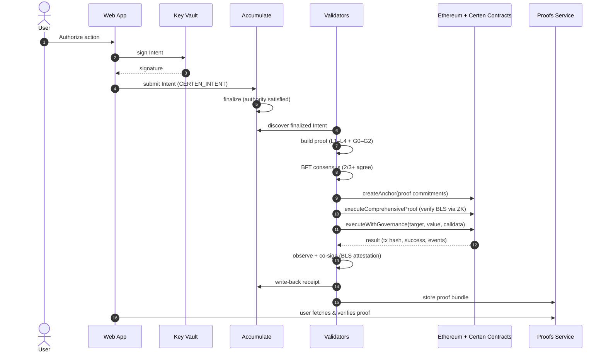
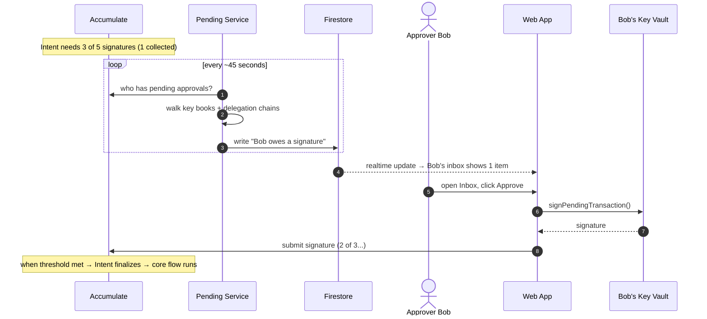
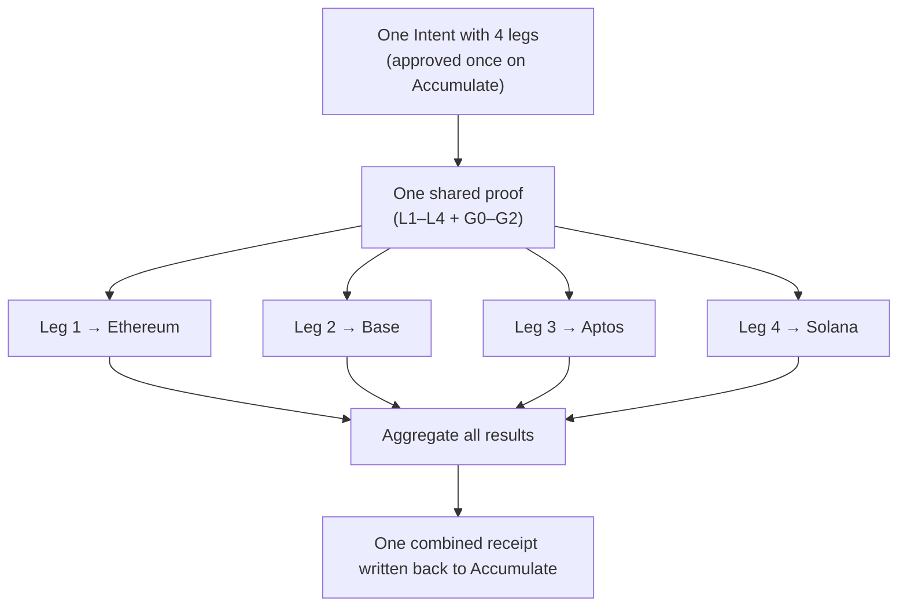
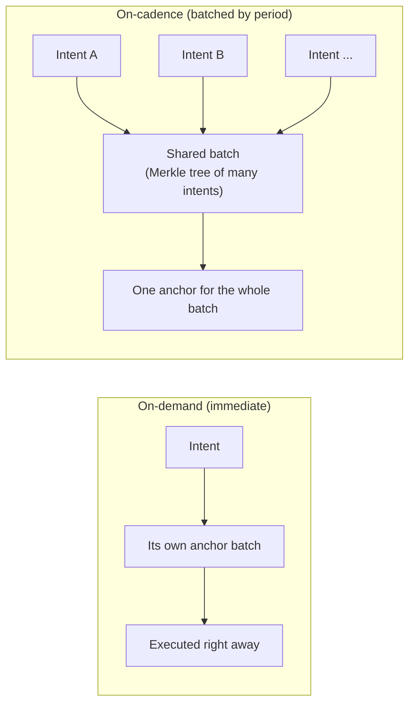
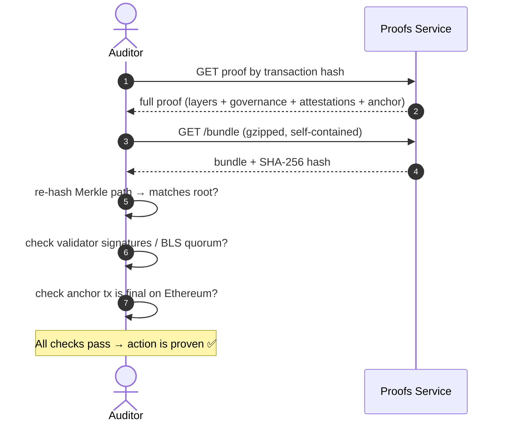
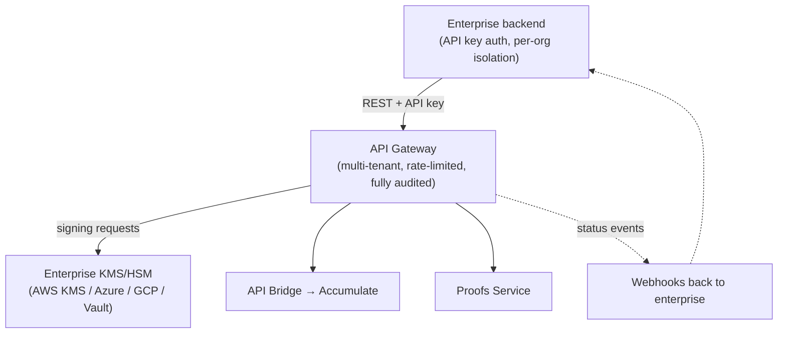
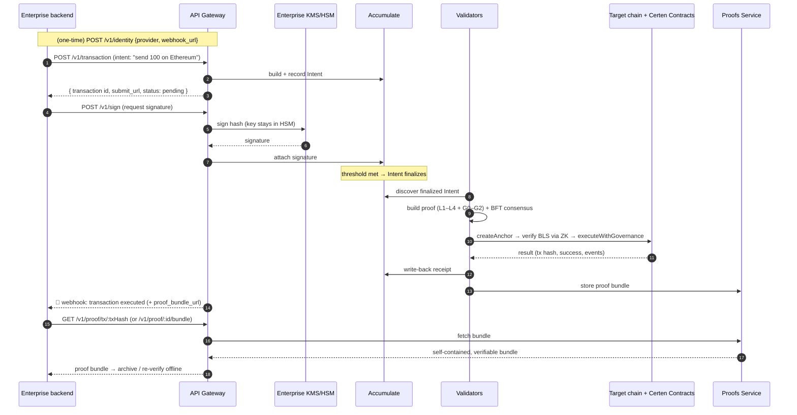

# 03 — End-to-End Workflows (every capability, step by step)

[← Back to index](./README.md)

This document walks through **every major thing Certen can do**, from the user's
first click to the final verifiable result. Each workflow has a plain-English
summary, a diagram, and a numbered walkthrough.

**Capabilities covered:**
1. [Onboarding: create an identity (ADI)](#1-onboarding--create-an-identity-adi)
2. [Setting up governance (key pages, thresholds, delegation)](#2-setting-up-governance)
3. [Linking external-chain accounts](#3-linking-external-chain-accounts)
4. [A single cross-chain action](#4-a-single-cross-chain-action-the-core-flow)
5. [A multi-signature approval](#5-a-multi-signature-approval)
6. [A multi-leg cross-chain action](#6-a-multi-leg-cross-chain-action)
7. [On-demand vs on-cadence proofs](#7-on-demand-vs-on-cadence-proofs)
8. [Viewing & independently verifying a proof](#8-viewing--independently-verifying-a-proof)
9. [Enterprise integration via the API Gateway (the full lifecycle)](#9-enterprise-integration-via-the-api-gateway-the-full-lifecycle)

---

## 1. Onboarding — create an identity (ADI)

**Plain English:** A new user creates their on-chain identity (an ADI, like
`acc://acme.acme`) and a key to control it. The key is generated and stored in
the browser Key Vault; only signatures ever leave it.

**Walkthrough:**
1. User signs up (Firebase Auth handles login).
2. User installs the **Key Vault** extension and creates a password; a 12/24-word
   seed phrase is generated and backed up. Keys are encrypted at rest.
3. The web app asks the Vault for a public key to base the identity on.
4. The **API Bridge** builds the Accumulate transactions that create the ADI, its
   key book (permissions), and buys "credits" (Accumulate's gas).
5. The Vault signs; the bridge submits to Accumulate. The identity is now live.

---

## 2. Setting up governance

**Plain English:** The user defines *who can approve what* — by creating key
pages, setting signature thresholds (e.g. "3 of 5"), and optionally delegating
authority to other identities.

**Walkthrough:**
1. On the **World** page, the user edits the governance tree of an ADI.
2. They add **key pages** (each lists signer public keys) and set a **threshold**
   (how many signatures are required).
3. Optionally they **delegate**: allow another identity's key page to sign on
   their behalf — this creates a multi-hop "authority chain."
4. Each change is an Accumulate transaction (built by the bridge, signed by the
   Vault). From now on, every action obeys these rules — and the **governance
   proof (G1)** later proves the rules were followed.

---

## 3. Linking external-chain accounts

**Plain English:** For each blockchain the user wants to act on, Certen deploys a
**smart account** controlled by the user's Accumulate identity. Thanks to clever
address math (CREATE2), the account has the **same address on every EVM chain**.

**Walkthrough:**
1. User picks a chain to link.
2. The **API Bridge** calls that chain's **Account Factory**.
3. The factory deploys a **smart account** at a **predictable address** (it can
   even be known *before* deployment) and binds it to that chain's **Anchor**
   contract.
4. The account is now ready to receive proof-authorized instructions. For non-EVM
   chains the same idea applies with each chain's native account model.

---

## 4. A single cross-chain action (the core flow)

**Plain English:** The headline capability. The user authorizes one action
("send 100 tokens on Ethereum"); Certen proves it was authorized and executes it,
then files a receipt.

**Walkthrough (the 3 on-chain contract calls in step "execute" matter):**
1. User authorizes; the **Intent** is recorded and finalized on Accumulate.
2. Validators **discover** it, **build the proof**, and **agree** via consensus.
3. On the target chain, three contract calls happen in order:
   - **`createAnchor`** — record the proof's fingerprints (commitments).
   - **`executeComprehensiveProof`** — the **Anchor** asks the **BLS Verifier** to
     confirm (via a tiny ZK proof) that 2/3+ validators signed.
   - **`executeWithGovernance`** — the **Account** checks the proof one more time
     (including the *execution tie*) and performs the action.
4. Validators **watch** the result, **co-sign** it, **write a receipt** back to
   Accumulate, and **archive** the full proof in the Proofs Service.
5. The user (or any auditor) can pull the proof and verify it independently.

---

## 5. A multi-signature approval

**Plain English:** When a key page requires several signatures (e.g. 3-of-5), the
**Pending Service** notices who still needs to sign and notifies them. Each
approver signs from their own Key Vault. Only when the threshold is met does the
Intent finalize and the core flow (above) proceed.

**Walkthrough:**
1. An Intent sits **pending** because it lacks enough signatures.
2. The **Pending Service** polls Accumulate every ~45s, walks each user's key
   books **and delegation chains** (up to 20 hops), and figures out exactly who
   can and still needs to sign.
3. It writes those "to-do" items to **Firestore**, which the web app subscribes
   to — so approvers see a **live inbox** without refreshing.
4. Each approver signs from their own Vault. When the threshold is reached, the
   Intent finalizes and the validator network takes over.

---

## 6. A multi-leg cross-chain action

**Plain English:** One approval, several destinations (e.g. "pay these 4 vendors
on 4 different chains"). Certen proves the single intent once, executes each
"leg" on its chain, and aggregates all the results into one combined receipt.

**Walkthrough:**
1. The user approves a **single** multi-leg intent.
2. The validators build **one** proof; each chain's **Anchor** receives the legs
   destined for it.
3. Each leg executes on its own chain and is observed independently.
4. All leg results are **aggregated** and written back to Accumulate as one
   receipt — so the audit trail shows the whole operation as a unit.

---

## 7. On-demand vs on-cadence proofs

**Plain English:** Two speed/cost tiers. **On-demand** = execute immediately
(premium). **On-cadence** = batch many actions together every ~15 minutes and
anchor them as a group (cheaper, because the on-chain cost is shared).

**Walkthrough:**
- The choice is set per intent (`proof_class`).
- **On-cadence** intents are collected into a **batch**, combined into a single
  **Merkle tree**, and anchored once — each intent gets a small **Merkle
  inclusion proof** showing it was in that batch.
- **On-demand** intents skip the wait and get their own immediate anchor.
- For on-demand intents, Certen requires a full **consensus-bound chained proof**
  (with bounded retries if a piece isn't ready yet) rather than silently
  downgrading to a weaker proof.

---

## 8. Viewing & independently verifying a proof

**Plain English:** Anyone with a proof can check it themselves — no need to trust
Certen. The Proofs Service can hand out a self-contained "bundle" that an auditor
can verify offline.

**Walkthrough:**
1. Look up a proof by its Accumulate transaction hash (or proof ID).
2. Download the **bundle** — it contains all four proof components plus the
   validator attestations.
3. Re-compute the Merkle path, verify the validator signatures (or the aggregated
   BLS quorum), and confirm the anchor transaction is finalized on the target
   chain. If everything matches, the action is mathematically proven.

The web app's **Vault** page does this visually (Merkle tree explorer), but the
same checks can be scripted by any third party.

---

## 9. Enterprise integration via the API Gateway (the full lifecycle)

Sections 1–8 told the story through Certen's **own web app and Key Vault** — the
way a person clicks through it. An enterprise never touches that UI. It drives the
**exact same system from its own backend**, over one authenticated REST API: the
**API Gateway** (the "Stripe for Governance" surface). This section walks the
**whole lifecycle again, end to end, but from the enterprise's side** — the same
six stages, expressed as API calls and webhooks instead of clicks.

The two big differences from the web-app flow:

- **No browser wallet.** Signing is delegated to the enterprise's existing
  **key-management provider** (AWS KMS, Azure Key Vault, GCP KMS, HashiCorp Vault).
  Private keys never leave the enterprise's HSM/KMS.
- **No inbox to watch.** Instead of the Pending Service pushing to a UI, the
  Gateway fires **webhooks** at the enterprise's systems on every status change.

### 9a. The enterprise lifecycle, stage by stage

| Stage (mirrors §1–8) | API Gateway call(s) | What it does |
|---|---|---|
| **Authenticate** | every request carries an **API key** | Scopes the org, enforces rate limits, writes the audit log |
| **Onboard an identity** (§1) | `POST /v1/identity` (with `provider` + `webhook_url`) | Orchestrates ADI + key book + credits **and** registers the signing provider in one call |
| **Set up governance** (§2) | `POST /v1/governance`, `POST /v1/governance/:id/signature`, `GET /v1/governance/:id` | Create/update key pages, thresholds (m-of-n), delegation |
| **Link chain accounts** (§3) | part of identity orchestration (`GET /v1/identity/:id?include=accounts`) | Deploys the smart accounts and reports their addresses |
| **Submit an action** (§4) | `POST /v1/transaction` → returns a `submit_url` | Builds the Intent and submits it to Accumulate |
| **Sign** (§4–5) | `POST /v1/sign` → `POST /v1/sign/:id/signature`, or `POST /v1/transaction/:id/signature` | Signing happens **inside the enterprise's KMS**, not a browser |
| **Multi-sig approvals** (§5) | `GET /v1/pending` + **webhooks** | Each required approver's system is notified and signs in turn |
| **Track to completion** (§4) | `GET /v1/transaction/:id` + **webhooks** | Status moves pending → executed; returns a `proof_bundle_url` |
| **Fetch & verify proof** (§8) | `GET /v1/proof/:id`, `GET /v1/proof/:id/bundle`, `GET /v1/proof/tx/:txHash`, `GET /v1/proof/:id/custody` | Pull the verifiable bundle for compliance/audit |
| **Portfolio / reporting** | `GET /v1/portfolio`, `GET /v1/transactions` | Balances and history across all linked chains |

### 9b. The core action, end to end, over the API

This is the enterprise mirror of the **core flow in §4** — same proof, same
validators, same on-chain execution, just driven by API calls and webhooks.

**Walkthrough:**
1. **One-time setup.** `POST /v1/identity` with a `provider` (the enterprise's KMS)
   and a `webhook_url` creates the ADI, governance, credits, and chain accounts,
   and wires up where status events should be delivered.
2. **Submit.** `POST /v1/transaction` builds and records the Intent; the response
   includes the transaction `id` and a `submit_url`, and an initial `pending`
   status.
3. **Sign in the HSM.** `POST /v1/sign` (then `/v1/sign/:id/signature`) has the
   Gateway ask the enterprise's **KMS** to sign — the private key never leaves the
   enterprise boundary. For additional approvers, each signs the same way.
4. **Threshold & hand-off.** When the key page's threshold is met, the Intent
   finalizes on Accumulate and the **validator network takes over** — identical to
   §4 from here on (discover → prove → consensus → anchor → execute → observe →
   write-back).
5. **Webhook, not polling.** The Gateway fires a **webhook** when the transaction
   reaches a terminal state, carrying a `proof_bundle_url`. (Systems that prefer
   polling can `GET /v1/transaction/:id` instead.)
6. **Fetch & verify.** The enterprise pulls the **proof bundle** and can verify it
   **offline**, exactly as an auditor does in §8 — re-hash the Merkle path, check
   the BLS quorum, confirm the anchor tx is final on chain. `GET /v1/proof/:id/custody`
   additionally returns the chain-of-custody record for compliance.

### 9c. Why this matters for enterprises

- **Same guarantees, zero UI.** The enterprise gets the identical
  cryptographic proof a web-app user gets — but fully programmatically, fit for
  CI/CD pipelines, treasury systems, or an internal approval portal.
- **Keys stay home.** Signing is delegated to the org's own KMS/HSM; Certen never
  holds enterprise keys.
- **Audit-ready by construction.** Every call is on the Gateway's audit log, and
  every executed action yields an independently verifiable proof bundle.

The **API Bridge** underneath is the lower-level, Accumulate-native service; the
**Gateway** wraps it with auth, multi-tenancy, KMS signing, webhooks, and audit —
everything an enterprise needs to treat Certen as infrastructure.

---

Continue to **[04 — Proof Types & Their Parts →](./04-proof-types-and-parts.md)**
