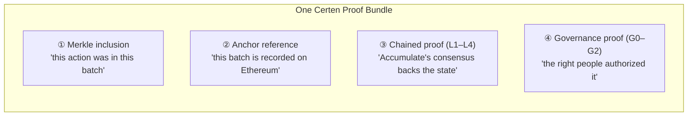
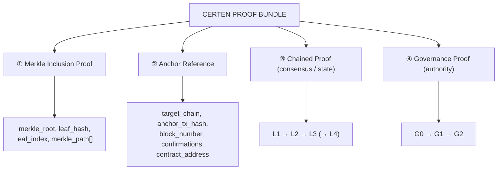
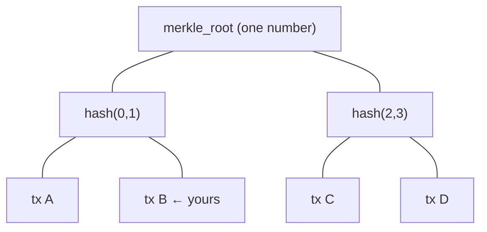
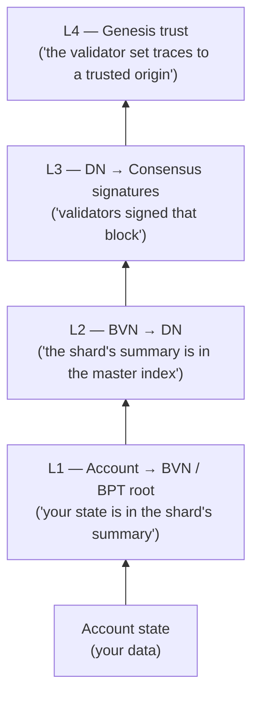
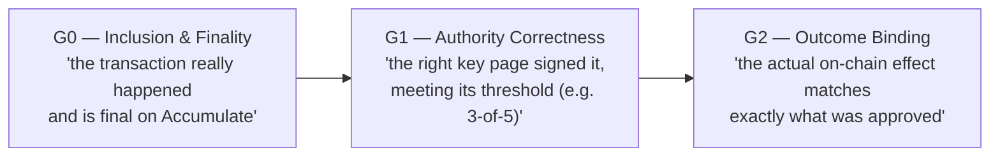
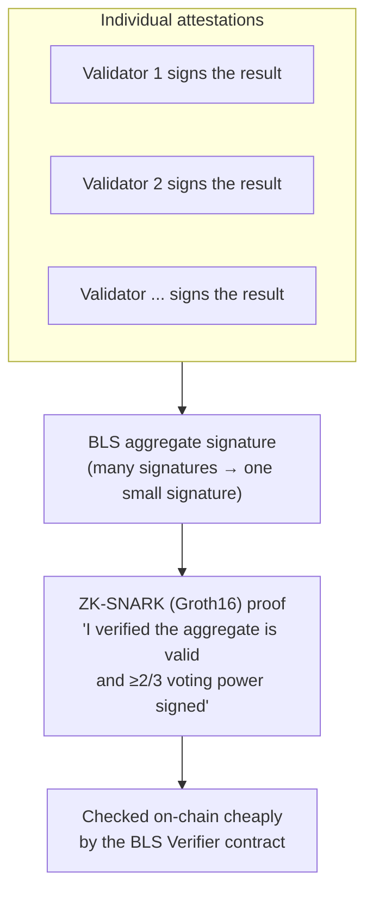
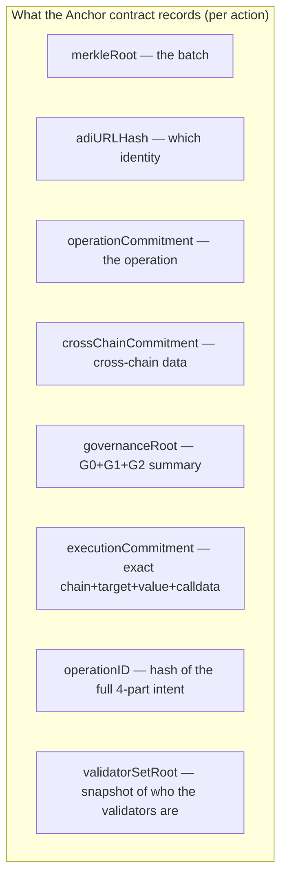
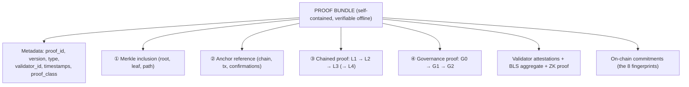

# 04 — Proof Types & What They're Made Of

[← Back to index](./README.md)

This document answers: **what is a Certen "proof," what kinds are there, and what
parts does each one contain?**

---

## 1. What "proof" means here (and why it's special)

A Certen proof is **cryptographic evidence** — a package of numbers that lets
*anyone* re-check that something is true, using only math. It does **not** ask you
to trust Certen, a validator, or a server.

A good analogy: a **sealed certified-mail envelope** where every seal can be
independently inspected:

**Every complete proof has four components.** Two of them (the chained proof and
the governance proof) are themselves made of multiple *layers*. We'll unpack each.

---

## 2. The four components of a complete proof

| # | Component | Plain-English question it answers | Key fields |
|---|---|---|---|
| ① | **Merkle inclusion** | "Was this exact transaction part of the anchored batch?" | `merkle_root`, `leaf_hash`, `leaf_index`, `merkle_path[]` |
| ② | **Anchor reference** | "Where on an external chain is the fingerprint of that batch recorded, and is it final?" | `target_chain`, `anchor_tx_hash`, `anchor_block_number`, `confirmations`, `contract_address` |
| ③ | **Chained proof (L1–L4)** | "Does Accumulate's own consensus vouch for the state behind this?" | layered receipts (see §4) |
| ④ | **Governance proof (G0–G2)** | "Did the legitimately-authorized parties approve it?" | layered authority data (see §5) |

---

## 3. Component ① & ②: Merkle inclusion + Anchor reference

### Merkle inclusion — "it's in the batch"

A **Merkle tree** lets you prove one item belongs to a large set by revealing only
a short path of hashes, not the whole set.

- Your transaction is a **leaf** (`leaf_hash`) at position `leaf_index`.
- The `merkle_path` is the handful of sibling hashes needed to climb to the
  `merkle_root`. Re-hash along the path; if you reach the same root, your
  transaction was provably included — and nothing was altered.

### Anchor reference — "the batch is on a real chain"

This component points to the **anchor transaction** on the external chain that
recorded the batch's `merkle_root` (plus other commitments). It includes which
chain, the transaction hash, block number, how many confirmations it has, and
whether it's final. That's what makes the proof **publicly checkable** by anyone
with a block explorer.

---

## 4. Component ③: the Chained Proof (L1–L4) — consensus & state

This is the ladder that ties an action all the way back to Accumulate's consensus.
Think of it as proving a fact "all the way up the chain of command."

| Layer | Proves | Contains (key parts) |
|---|---|---|
| **L1** Account → BVN | Your account's state is part of the shard's official state summary (the **app_hash / BPT root**) | `bvn_partition`, `source_hash`, `target_hash`, receipt entries |
| **L2** BVN → DN | That shard summary is anchored into Accumulate's master index (Directory Network) | `bvn_root`, `dn_root`, `anchor_sequence` |
| **L3** DN → Consensus | The master block was **signed by the validators** (the consensus that makes it official) | `dn_block_hash`, `dn_block_height`, consensus timestamp, signatures |
| **L4** Genesis trust | The signing validator set itself traces back to a trusted starting point | validator-set / genesis linkage |

> **Honest status note:** L1–L3 are live and enforced, and the **L4 consensus
> binding is live and fail-closed today** (a proof that doesn't tie back to
> Accumulate's consensus is rejected outright). The remaining piece of L4 — the
> *full* genesis-to-now validator-set proof, with per-signature and voting-power
> checks — depends on capabilities the **current Accumulate mainnet does not yet
> expose** to lite clients. Certen is **working directly with the Accumulate core
> developers** to add that ability at the protocol level; once it lands, the
> complete L4 validator-set proof can be enforced end-to-end. The accurate
> one-liner: *"L1–L3 done; L4 binding live and fail-closed; the full L4
> validator-set proof is in progress with Accumulate core."*

**Why "chained"?** Each layer is cryptographically linked to the next. If any
single link is faked, the chain breaks and verification fails — you can't forge
an intermediate step without breaking the whole thing.

---

## 5. Component ④: the Governance Proof (G0–G2) — authority

This proves the action was **legitimately authorized** under the identity's own
rules. Three levels, increasing in strength:

| Level | Plain meaning | Contains (key parts) |
|---|---|---|
| **G0** Inclusion & finality | The transaction is in a block and that block is final/anchored | block height, finality timestamp, anchor height, `is_anchored` |
| **G1** Authority correctness | The approving key page existed, the signers were on it, and the **threshold** (m-of-n) was met | authority URL, key-page state (version, keys, threshold m/n), signature count |
| **G2** Outcome binding | The executed transaction's **payload and effects** match what was authorized (so nothing was swapped) | payload verification (computed vs expected hash), effect verification (success/revert/events) |

**Why three levels?** Different use cases need different assurance. A read-only or
low-value action might be fine at **G1**; a value-moving transfer requires **G2**
(outcome binding) so the on-chain effect is provably the one that was approved.

---

## 6. The signature & attestation pieces (how the group vouches)

Two cryptographic mechanisms make the validators' collective endorsement both
**trustworthy** and **cheap to check on-chain**:

| Piece | What it is | Key parts |
|---|---|---|
| **Validator attestation** | One validator's signature over the result hash | `validator_id`, public key, signature, `signature_valid` |
| **BLS aggregate** | All those signatures combined into one (using BLS12-381) | aggregate signature, aggregate public key, validator bitfield, voting-power % |
| **ZK-SNARK (Groth16)** | A tiny proof that "the aggregate is valid and met the 2/3 threshold," so the chain doesn't redo expensive pairing math | Groth16 proof (a, b, c), public inputs: message hash, voting power signed/total, threshold |

**Why this matters:** checking dozens of individual signatures on Ethereum would
be expensive. BLS shrinks them to one; the ZK proof shrinks the *verification*
down to something a contract can confirm cheaply. That's how Certen keeps on-chain
costs low while preserving "2/3 of validators vouched for this."

---

## 7. The fingerprints ("commitments") an Anchor stores

When the action is anchored on-chain, the contract doesn't store the whole proof
(too big/expensive). It stores compact **commitments** — fixed-size fingerprints
— and the BLS signature is bound to all of them at once:

These are the on-chain anchors of the off-chain proof. The **executionCommitment**
and **operationID** are what make a proof impossible to replay for a different
action; the **validatorSetRoot** is what makes it impossible to replay with a
stale set of validators. (Details in [06 — Contracts](./06-contracts-explained.md).)

---

## 8. The whole proof, assembled

Putting all the parts together, here's what a complete proof bundle looks like:

The **Proofs Service** stores all of this in a database and can serve it as a
gzipped bundle with a SHA-256 hash, so an auditor can verify integrity and then
re-check each component independently.

---

## 9. Quick reference: every proof artifact type

For the more technical readers, these are the distinct artifact types the system
produces and stores:

| Artifact | What it captures |
|---|---|
| Merkle inclusion proof | Membership of a tx in a batch |
| Anchor record / reference | The external-chain transaction recording a batch |
| Chained proof (L1–L4) | Accumulate consensus/state ladder |
| Governance proof (G0–G2) | Authorization correctness |
| Validator attestation (Ed25519) | One validator's endorsement of a proof |
| External chain result (the "execution proof") | The observed on-chain outcome (tx, block, status, events, state root) |
| BLS attestation | One validator's BLS signature on the result |
| Aggregated BLS attestation | Combined quorum signature + threshold met |
| Proof bundle | Everything above, packaged for offline verification |

---

Continue to **[05 — How Proofs Are Used →](./05-how-proofs-are-used.md)**
