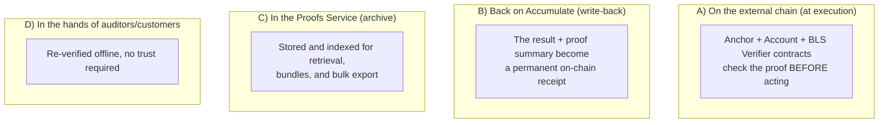
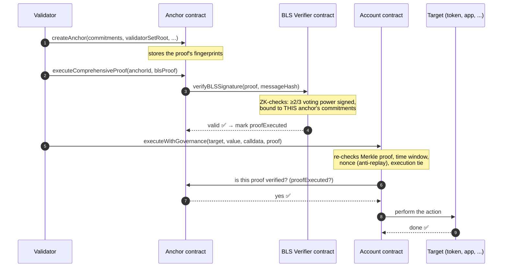
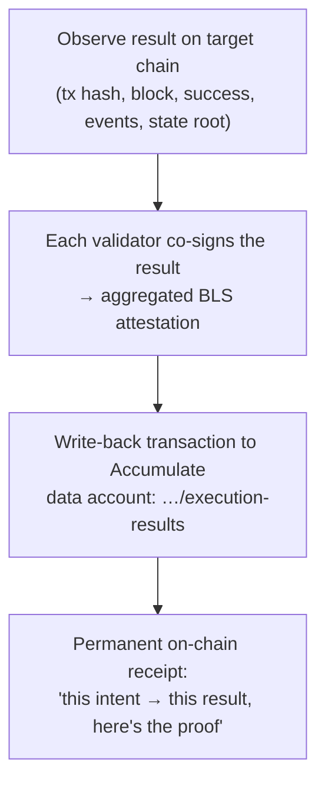
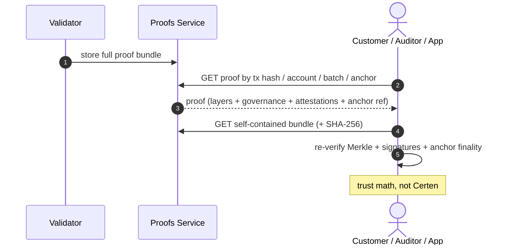
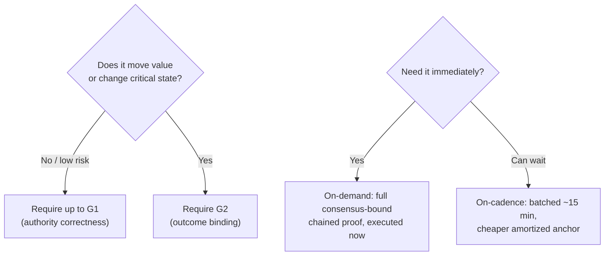
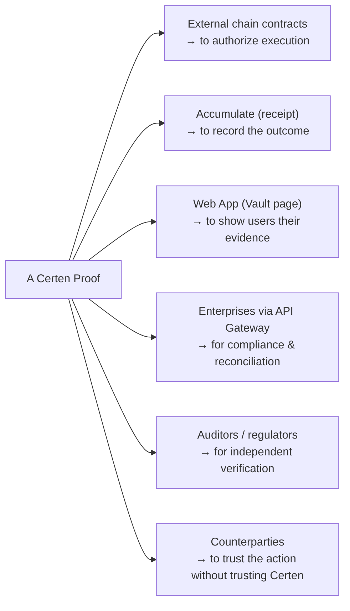

# 05 — How Proofs Are Used: Where & When

[← Back to index](./README.md)

The previous doc explained *what proofs contain*. This one explains *how they're
used in practice* — the full life of a proof, and the exact moments where each
proof does its job.

---

## 1. The life of a proof (cradle to grave)

```mermaid
flowchart LR
    req["Requested<br/>(intent finalized)"] --> build["Built<br/>(L1–L4, G0–G2)"]
    build --> agree["Agreed<br/>(validator consensus)"]
    agree --> anchor["Anchored<br/>(committed on external chain)"]
    anchor --> exec["Used to execute<br/>(contract verifies & acts)"]
    exec --> attest["Attested<br/>(BLS quorum co-signs result)"]
    attest --> writeback["Written back<br/>(receipt on Accumulate)"]
    writeback --> store["Stored<br/>(Proofs Service archive)"]
    store --> verify["Verified<br/>(anyone, anytime)"]
```

Each stage is a place where a proof (or part of one) is **used**. Let's go through
the three that matter most: **execution-time on-chain use**, **write-back use**,
and **after-the-fact verification use**.

---

## 2. WHERE proofs are used — the four locations

| Location | When | What the proof does there |
|---|---|---|
| **A. External chain contracts** | At the moment of execution | The proof is the **key** that unlocks action. No valid proof → nothing happens. |
| **B. Accumulate (write-back)** | Right after execution | The proof summary + result is recorded as the **official receipt**, closing the loop. |
| **C. Proofs Service** | Continuously | The proof is **archived, indexed, and served** so anyone can fetch it later. |
| **D. Auditors / customers** | Anytime afterward | The proof is **independently re-verified** with math alone. |

---

## 3. Use A (the critical one): proofs gate on-chain execution

This is the heart of Certen's security. On the external chain, **three contracts
check the proof in sequence**, and execution only proceeds if all checks pass.

**When each check happens and why:**

| Step | Proof part used | Guards against |
|---|---|---|
| `createAnchor` | The 8 commitments (Merkle root, execution commitment, operationID, validatorSetRoot, …) | Recording an action that wasn't agreed; pins it to the exact operation |
| `executeComprehensiveProof` | BLS aggregate + ZK proof (component from [04 §6](./04-proof-types-and-parts.md#6-the-signature--attestation-pieces-how-the-group-vouches)) | A minority of validators acting alone; only a **2/3 quorum** passes |
| `executeWithGovernance` | Merkle inclusion + governance + **execution tie** | Replays, parameter-swapping, wrong-chain reuse, expired proofs |

The **execution tie** (`executionCommitment`) check is worth repeating: the
contract recomputes `hash(chainId, target, value, calldata)` and demands it match
what the proof committed to. A proof authorizing "send 100 to Alice on Ethereum"
**cannot** be reused to "send 1,000,000 to Mallory" or run on a different chain.

---

## 4. Use B: write-back proofs create the permanent receipt

After execution, the validators don't just walk away — they **observe** the
result, **co-sign** it, and **write it back** to Accumulate. This write-back is
itself proof-backed.

**When:** immediately after the target chain confirms the action.
**Where:** the Certen network's own Accumulate data account
(`acc://certen-protocol.acme/execution-results`).
**Why it matters:** the original decision and its real-world outcome now live
**together on the same trusted ledger** — a complete, tamper-evident audit trail
from "we decided X" to "X happened, proven."

---

## 5. Use C & D: archive and independent verification

- **Archive (C):** the **Proofs Service** indexes every proof so it's findable by
  transaction hash, account, batch, or anchor — and offers bulk export for
  compliance teams.
- **Independent verification (D):** the bundle is **self-contained**. An auditor
  re-hashes the Merkle path, checks the validator/BLS signatures, and confirms the
  anchor transaction is final on the public chain. No part of this requires
  trusting Certen's servers.

---

## 6. WHEN each proof level is required (the rules of thumb)

Not every action needs the maximum proof. The system matches proof strength to
risk:

| Situation | Proof requirement |
|---|---|
| Low-value / read-ish operation | Governance up to **G1** may suffice |
| Value-moving transfer | **G2** outcome binding required (effect must match approval) |
| Time-sensitive | **On-demand** with a full consensus-bound chained proof; bounded retries if a layer isn't ready, rather than downgrading |
| Cost-sensitive, batchable | **On-cadence**: combined into a Merkle batch, one shared anchor |

---

## 7. Who consumes proofs, and why

The single most important point for founders: **the same proof serves all of
these consumers**, because it's verifiable by anyone. That's the product's core
value — *one piece of evidence that everyone, everywhere, can independently
trust*.

---

Continue to **[06 — The Smart Contracts Explained →](./06-contracts-explained.md)**
