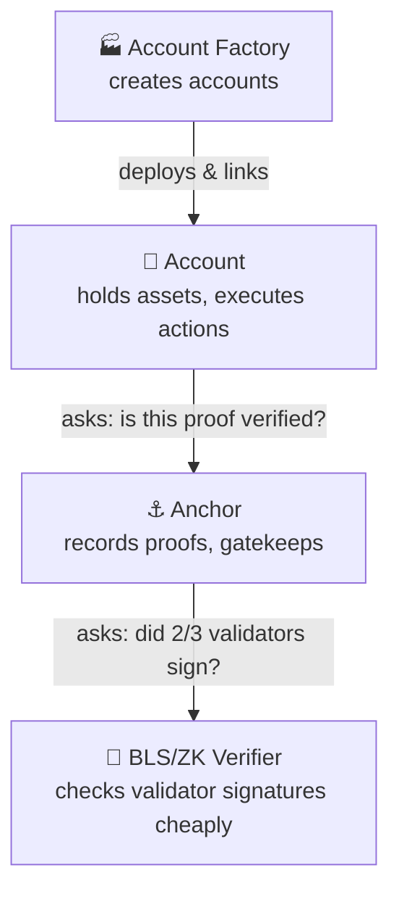
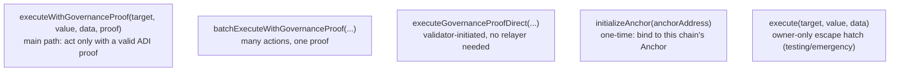
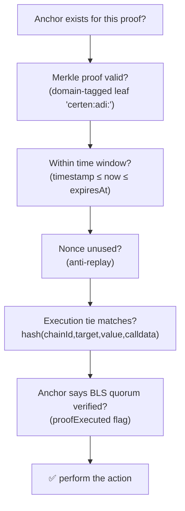
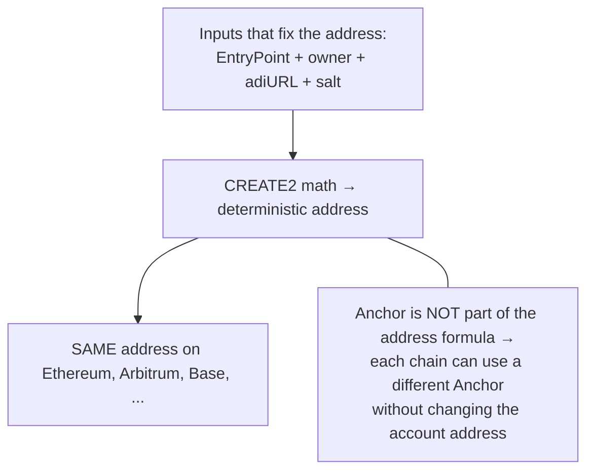
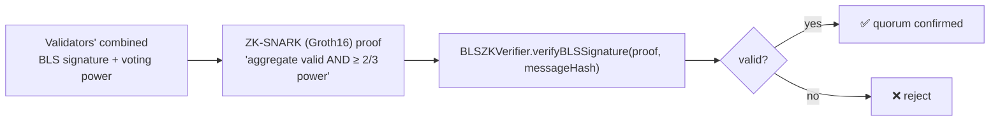
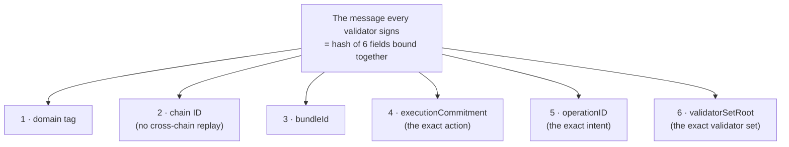
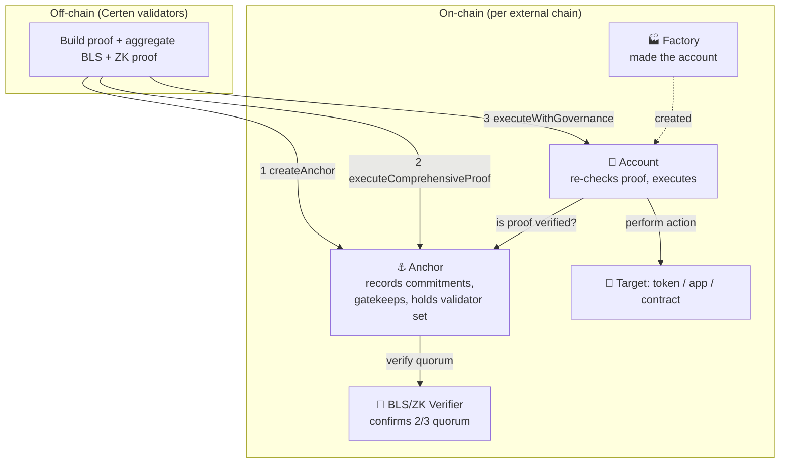

# 06 — The Smart Contracts Explained

[← Back to index](./README.md)

This document explains the four on-chain contracts that make Certen work on each
external chain: the **Account**, the **Account Factory**, the **BLS/ZK Verifier**,
and the **Anchor**. Each section starts plain and adds detail.

> The examples below use the **EVM (Solidity)** contracts, which run on Ethereum,
> Arbitrum, Base, Polygon, Hedera, etc. Non-EVM chains (Solana, Aptos, Sui, NEAR,
> TON, Cardano) have **functionally equivalent** contracts written in each chain's
> native language. The roles and checks are the same; only the code differs.

---

## 1. How the four contracts fit together



| Contract | One-line job | Analogy |
|---|---|---|
| **Account** | The user's on-chain wallet that only acts on proof-authorized instructions | A safe that opens only with a verified order |
| **Account Factory** | Mass-produces accounts at predictable addresses | The locksmith that builds identical safes |
| **Anchor** | Records each proof's fingerprints and acts as the gatekeeper | The notary's logbook + the gate |
| **BLS/ZK Verifier** | Confirms a 2/3 validator quorum signed, cheaply | The signature-checking machine |

---

## 2. The Account contract

### What it does (plain)
It's a smart **wallet that belongs to an Accumulate identity (ADI)**. It can hold
tokens and perform actions, but — crucially — it will only do so when shown a
**valid governance proof**. The owner can't just move funds on a whim if the
governance rules say otherwise.

It's built on the **ERC-4337 "account abstraction"** standard, which (among other
things) allows gasless and flexible transaction flows.

### Key functions



### What it checks before acting

When asked to execute with a proof, the Account verifies (in order):



- **Domain-tagged Merkle leaf:** the account rebuilds the leaf exactly as the
  anchor stored it (`keccak256("certen:adi:" + adiURLHash)`), preventing
  "leaf-swap" tricks.
- **Execution tie:** recomputes the fingerprint of the *actual* call and demands
  it equal what the proof committed to — the anti-parameter-swap guarantee.
- **Authority levels:** the account understands roles (`OPERATOR`, `MANAGER`,
  `ADMIN`, `ROOT`) and can require a minimum level per operation.

### State it keeps
The ADI URL it belongs to, the linked Anchor contract, used-proof records (replay
protection), per-operation nonces, and role information.

---

## 3. The Account Factory

### What it does (plain)
It **deploys Account contracts** — and does so at a **predictable address**. For
EVM chains, the same identity gets the **same account address on every chain**,
which is a big usability win (one address to remember, derivable in advance).

### The clever bit: address stability



- It uses **CREATE2** (a deterministic deployment method) via a standard keyless
  deployer, so the address can be computed **before** the account exists.
- The **Anchor address is deliberately excluded** from the address formula. That's
  why the same account address works across chains even though each chain has its
  own Anchor — the factory links the anchor *after* deployment via
  `initializeAnchor`, atomically in the same transaction (no front-running window).

### Key functions
- `createAccount(owner, adiURL, salt)` — deploy one account.
- `createAccountIfNotExists(...)` — idempotent (returns existing if already there).
- `batchCreateAccounts(...)` — deploy many at once.
- `getAddress(...)` — predict the address without deploying.
- `setAnchorContract(...)` — set the chain-specific Anchor (owner only).

It also keeps a registry (ADI → account) so each identity gets exactly one account
per chain.

---

## 4. The BLS/ZK Verifier

### What it does (plain)
It answers one question cheaply: **"Did a 2/3 supermajority of Certen validators
sign this?"** Checking many signatures directly on-chain would be slow and
expensive, so instead the validators produce a **zero-knowledge proof (Groth16)**
that the aggregate signature is valid and met the threshold, and this contract
verifies that little proof.



### What it checks
1. The proof's message hash equals the one the Anchor supplied (binding).
2. `signedVotingPower ≥ 2/3 × totalVotingPower` — using the **stored** threshold,
   not a caller-supplied one (so a caller can't lower the bar).
3. The Groth16 proof itself verifies against a **baked-in verification key**
   (immutable, audited, generated to match the prover exactly).

### Why two addresses?
In the live config you'll see a **V2 adapter** and a **V2 generated** address. The
"generated" contract is the raw ZK verifier (auto-generated to match the proving
circuit bit-for-bit); the "adapter" wraps it with Certen's interface and the
threshold/message-binding logic. The Anchor talks to the adapter.

---

## 5. The Anchor — the gatekeeper

### What it does (plain)
The Anchor is the **central gatekeeper** on each chain. It:
1. **Records** each proof's fingerprints (commitments) when an action is anchored.
2. **Verifies** the validator quorum (by calling the BLS Verifier).
3. **Gatekeeps** execution — the Account asks the Anchor "is this proof really
   verified?" before acting.
4. **Maintains the validator registry** and a snapshot of the current validator
   set.

### The three-call execution dance

```mermaid
sequenceDiagram
    autonumber
    participant Val as Validator
    participant Anchor
    participant BLS as BLS Verifier
    Val->>Anchor: 1. createAnchor(bundleId, commitments, operationID, ...)
    Note over Anchor: stores anchor; checks bundleId is derived<br/>from the commitments (no tampering)
    Val->>Anchor: 2. executeComprehensiveProof(anchorId, blsProof)
    Anchor->>BLS: verifyBLSSignature(...)
    BLS-->>Anchor: valid ✅ → set proofExecuted = true, set governance level
    Note over Anchor: 3. Account later calls executeWithGovernance<br/>and reads proofExecuted before acting
```

### What it stores per action (the commitments from [04 §7](./04-proof-types-and-parts.md#7-the-fingerprints-commitments-an-anchor-stores))
`merkleRoot`, `adiURLHash`, `operationCommitment`, `crossChainCommitment`,
`governanceRoot`, `executionCommitment`, `operationID`, the Accumulate block
height, plus flags (`valid`, `proofExecuted`, `governanceExecuted`) and the
governance level achieved.

### How the Anchor makes a signature impossible to replay
The Anchor binds **every validator signature to six independent fields at once** —
so a signature is only valid for one exact action, on one exact chain, by one
exact set of validators:



Each field closes off a different attack:
- The **chain ID** stops a signature from being replayed on a different chain.
- The **executionCommitment** stops the action's parameters (target/value/calldata)
  from being swapped.
- The **operationID** ties the signature to one specific approved intent.
- The **validatorSetRoot** ties it to the exact validator set: if validators are
  added/removed or the threshold changes, the snapshot changes and **old
  signatures instantly stop verifying** — no replay from a stale validator set.

### Key functions
- `createAnchor(...)` / `createAnchorWithLegs(...)` — record an action (single or
  multi-leg). Validator-only.
- `executeComprehensiveProof(anchorId, blsProof)` — verify the quorum via the BLS
  Verifier; flips `proofExecuted`.
- `verifyProof(anchorId, merkleProof, leaf)` — Merkle check used by Accounts.
- `registerValidator / removeValidator / setThreshold` — manage the validator set
  (each recomputes the validator-set snapshot).
- `getValidatorSetRoot()` / `getExecutionCommitment(anchorId)` — read helpers.

---

## 6. The complete on-chain picture



**The one-sentence summary of all four contracts:** the **Factory** builds an
**Account** that refuses to act until the **Anchor** — backed by the **BLS/ZK
Verifier** — confirms that a 2/3 validator quorum cryptographically approved
*this exact action*, traceable all the way back to a finalized, properly
authorized decision on Accumulate.

---

## 7. Caveats & current status (be honest with the team)

- **Non-EVM parity:** EVM chains run the full V6.1 binding. Non-EVM chains
  (Solana, Aptos, Sui, NEAR, TON, Cardano) have been brought to the same
  ("A+++") parity, each verified on-chain; a couple have known chain-specific
  limitations in *full* end-to-end runs that are tracked separately.
- **Proof depth:** on-chain checks rely on the off-chain proof. The deepest
  consensus layer (**L4** genesis/validator-set proof) has its consensus *binding*
  live and fail-closed today; the full validator-set proof is in progress with the
  Accumulate core developers (see
  [04 §4](./04-proof-types-and-parts.md#4-component--the-chained-proof-l1l4--consensus--state)).

---

Continue to **[07 — Possible Framing, and Monetization Paths →](./07-positioning-and-monetization.md)**
