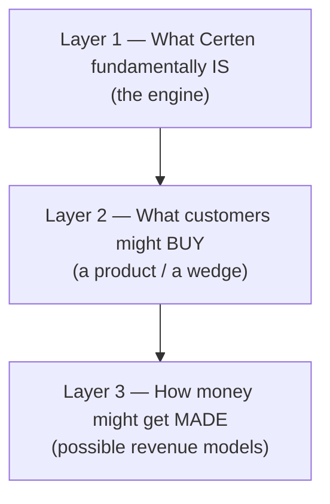
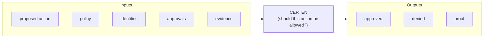
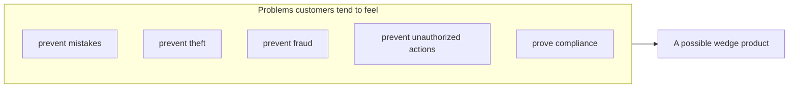
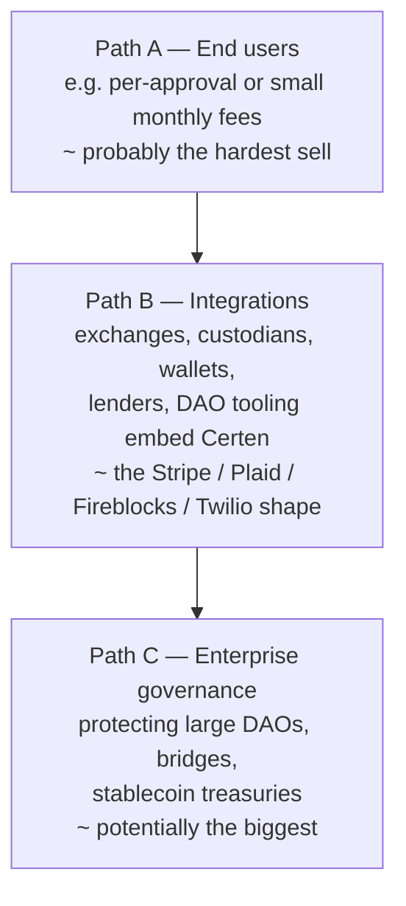
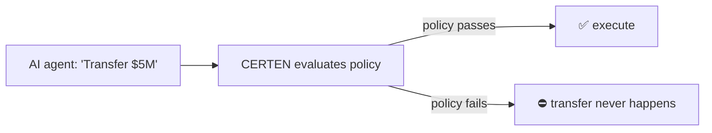
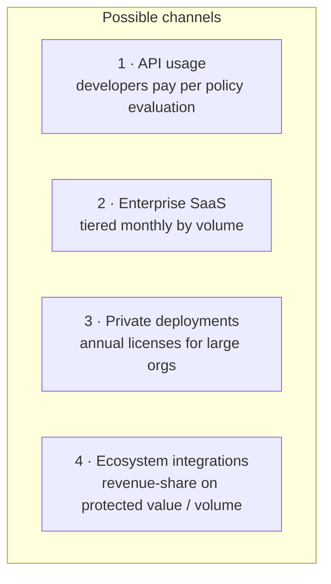

# 07 — Possible Framing, and Monetization Paths

[← Back to index](./README.md)

The earlier documents explain **how Certen works**. Think of this one as:
*"here's what I think I've actually built, and a few directions it might
point" — not a business plan.*

One framing I've found genuinely clarifying is to **keep three layers separate**,
because they're easy to blur:

---

## 1. Useful framing for Certen

From the inside, the purest description I'd give is: **a trust-decision engine.**

At its core it answers one question — **"Should this action be allowed?"** — and
emits a verifiable proof of the answer.

A thing worth noticing: from an engineering standpoint, **"governance" looks like
just one application** of the engine rather than the engine itself. The same
machinery could, in principle, serve treasury control, cross-chain operations,
lending controls, AI-agent guardrails, and more — they differ mainly in which
policy and actions get plugged in.

If I had to compress what the A+++ 6.1 work is really demonstrating into one
line, it would be:

> **Execution is conditional on proof.**

---

## 2. Layer 2 — what customers might actually buy

**The engine is hard to sell as an engine.** People don't tend to wake up wanting
"trust infrastructure" or "a policy engine" — they tend to want a problem to go
away:

A **narrow, instantly legible wedge** might land better than the full vision. One
candidate that's easy to explain is **Governance & Change Control**:

- software release / protocol-upgrade approvals
- treasury withdrawals
- key rotations
- validator additions

A phrasing I've toyed with for that wedge:

> **Cryptographic Change Control for Digital Assets and Autonomous Systems.**

The interesting part, if a wedge like that works, is that **customers may then
discover** they've bought something more general — a trust-decision engine — which
is where a larger platform story could open up.

---

## 3. Layer 3 — where the money might come from

The largest value may **not** sit with end users, because approval workflows feel
like infrastructure and people tend to resist paying for infrastructure directly.
A few directions, roughly ordered by how promising they *seem* from my seat:

- **Path A — End users.** Small per-approval or per-account fees. My instinct is
  this is the weakest, for the infrastructure-pricing reason above — but you'll
  know better.
- **Path B — Integrations.** Another platform (exchange, custodian, wallet, lender,
  DAO tooling) embeds Certen and pays, while their end users may never know it's
  there — the shape Stripe, Plaid, Fireblocks, and Twilio took.
- **Path C — Enterprise governance.** Where large value is at stake — a sizeable
  DAO treasury, a bridge, a stablecoin reserve, a big device network — the
  question "who approves changes?" may be a much larger problem than a per-action
  fee implies. The framing that resonates with me: customers there may be paying
  **to avoid catastrophe**, not paying for approvals.

### One technical angle worth surfacing

Because of the Accumulate heritage, there's a capability I think is easy to
under-sell. Most conversations stop at `identity → authorization → governance`
(proving *who approved*). But the engine can also sit **between intent and action
and actually block it** — i.e. `identity → policy → execution`:

That's the difference between an **audit system** (records what happened) and an
**enforcement system** (prevents what shouldn't). I suspect the latter is worth
considerably more.

---

## 4. Some monetization shapes to consider

| # | Possible channel | Who might pay | Illustrative only |
|---|---|---|---|
| 1 | **API usage** | developers | a small fee per policy evaluation |
| 2 | **Enterprise SaaS** | organizations | tiered monthly pricing by volume |
| 3 | **Private deployments** | large organizations | annual licenses |
| 4 | **Ecosystem integrations** | bridges, lenders, custodians | a share of protected value or volume |

If any of these has legs, channel 4 is the one I find most intriguing
technically: the business could scale with the **value it protects** rather than
seat counts.

---

## 5. One thing I'd gently flag to avoid

From watching the space, **token-gated approvals** ("users must buy a token to
approve a decision") have tripped up a lot of projects — they tend to add friction
to the exact workflow you want adopted. I'd lean against it on engineering and
UX grounds.

---

## 6. If it's useful: a short way to talk about the engine

One-liners to describe Certen:

- *"Execution is conditional on proof."* — the essence in five words.
- *"It decides whether an action should be allowed, and proves the answer."*
- *"Cryptographic change control for digital assets and autonomous systems."* — if
  a concrete, narrow framing helps.

---

[← Back to index](./README.md) · You've reached the end of the founder's guide.
