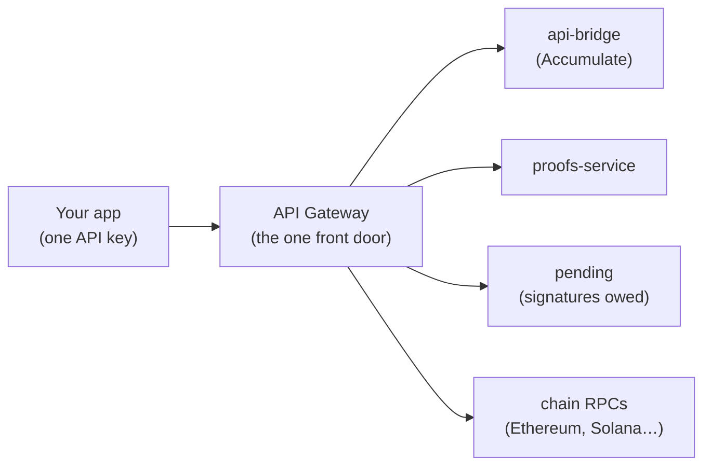
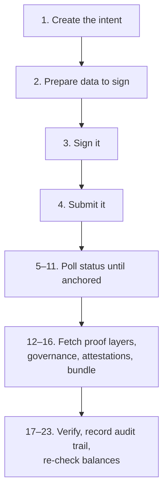
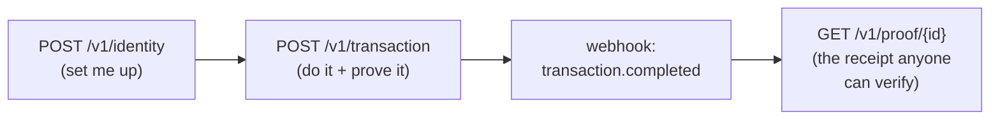
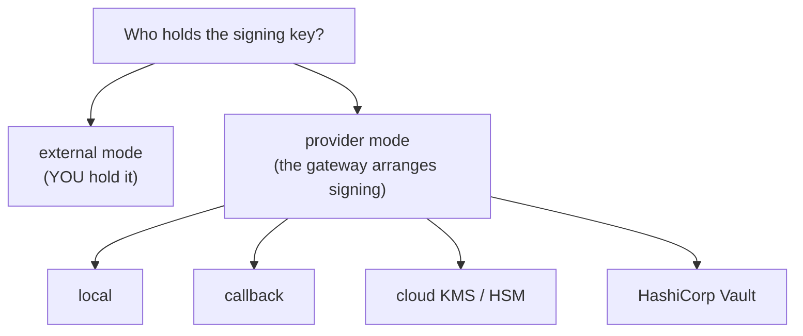
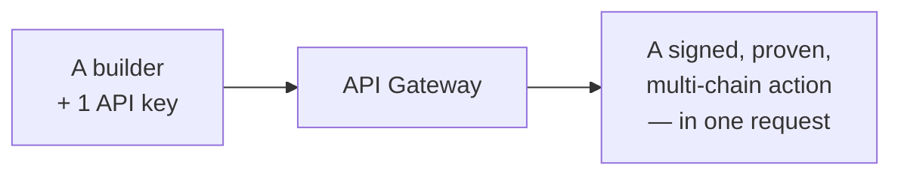

# 08 — The API Gateway (For Builders)

[← Back to index](./README.md)

> **Who this page is for:** anyone who wants to use Certen **from their own
> software** — a backend, a script, a custom dashboard — instead of clicking
> through the Certen web app and the KeyVault browser extension. No blockchain
> expertise assumed. If you've read pages 1–6, you already know *what* Certen
> does; this page is about the **one simple door** we built so you can drive it
> with code.

---

## 1. The one-paragraph version

Certen is really a **team of specialist services** working together — one that
talks to the Accumulate "governance brain," one that builds the cryptographic
proofs, one that watches for signatures that are still needed, one that talks to
each outside blockchain, and so on. That's great for power, but it means a single
real-world action ("send this, prove it, and record it") can take **dozens of
separate calls** across **five or six services**. The **API Gateway** is a single
new service that sits **in front of all of them** and exposes a **handful of
simple, high-level commands**. You send one request with one API key; the gateway
quietly does the 12-or-23-step dance behind the scenes and hands you back a clean
answer. It is the **"Stripe-style" front door** to the whole platform.

---

## 2. The mental model (analogy)

Think of the gateway as a **general contractor** for a building project.

| Real-world analogy | Certen component | What it is |
|---|---|---|
| You, the owner, with one phone number to call | **Your code + one API key** | How you ask for things |
| The general contractor who coordinates everyone | **API Gateway** | The single front door that orchestrates the work |
| The electrician, plumber, framer, inspector | **api-bridge, proofs-service, pending-service, validators, chain RPCs** | The specialist services that actually do the work |
| The signed permit / certificate of occupancy | **The proof** | Tamper-proof evidence the job was done correctly |

Without a general contractor, **you** have to hire and schedule every
subcontractor in the right order, in the right language, and hope nobody shows up
before the foundation is poured. With one, you say *"build me a kitchen"* and it
all just happens. That's the gateway.



---

## 3. Why this exists (instead of calling each service yourself)

You *could* talk to each Certen service directly. The web app does exactly that.
But everything that makes the platform powerful — multiple chains, multi-signer
governance, layered proofs — also makes the raw wiring **complicated and easy to
get wrong**.

Here is a single, ordinary cross-chain transaction, done the **hard way** (this is
what the web app juggles internally):



**That's 23 steps across four services for one action.** Do it by hand and you
own every retry, every "not ready yet, try again," every error format, and every
audit-log entry.

The gateway collapses that into **one call** — and adds the things a real
integration needs:

| What you'd build yourself | What the gateway gives you for free |
|---|---|
| Glue code across 5–6 services | One REST API, one base URL |
| Juggling several logins/secrets | **One API key** (`X-API-Key` header) |
| "Is it anchored yet?" polling loops | The gateway polls; you get a **webhook** when it's done |
| Your own records of who did what | A built-in **audit log** in the gateway's own database |
| Safe retries | **Idempotency keys** — sending the same request twice is safe |
| Worrying about breaking the web app | **Total isolation** — the gateway never touches the web app's data |

> **Important design choice:** the gateway is **purely additive**. It runs
> alongside the existing system on its own port and its own database and never
> modifies api-bridge, the proofs-service, the validators, or the web app. The
> web app keeps working exactly as before; the gateway is just a second, simpler
> way in — built for machines.

---

## 4. The compound methods (the heart of the gateway)

A **compound method** is one gateway command that bundles many lower-level
service calls into a single, meaningful business action. There are **seven**, and
they cover the full lifecycle of using Certen.

| # | Command | In plain English | What it bundles |
|---|---|---|---|
| 1 | `POST /v1/identity` | **"Set me up."** Create an identity, link blockchains, set who can approve. | ~12 Accumulate calls + chain setup |
| 2 | `POST /v1/transaction` | **"Do it and prove it."** Run a cross-chain action and produce a proof. | The full 23-step workflow |
| 3 | `POST /v1/governance` | **"Change the rules."** Add/remove approvers, change thresholds. | ~8 calls + signing |
| 4 | `GET /v1/proof/{id}` | **"Show me the receipt."** Get the complete proof with all its parts. | ~6 proof-service calls |
| 5 | `GET /v1/inbox` | **"What needs my signature?"** List actions waiting on approval. | Pending-discovery + enrichment |
| 6 | `POST /v1/inbox/{id}/sign` | **"I approve."** Sign/vote on a pending action. | Signing-path lookup + submit |
| 7 | `GET /v1/portfolio` | **"How am I doing?"** All balances + identity status, every chain at once. | 15+ chain queries + Accumulate |

Two of these are the real **end-to-end "composite" commands** — the ones that
turn a mountain of work into a single request. They're worth calling out:

### ⭐ `POST /v1/identity` — onboard in one call

Behind this single request, the gateway creates your on-chain identity (your
"ADI"), sets up its key book and approval rules, funds it with the network
"credits" it needs to operate, **waits for each step to actually settle** (the
network is eventually-consistent, so this is fiddly to do by hand), links every
blockchain you asked for, and registers you so the gateway starts watching for
work on your behalf. You get back a ready-to-use identity.

### ⭐ `POST /v1/transaction` — act + prove in one call

This is the flagship. One request kicks off the entire "do the action on chain A,
anchor the decision, generate the layered proof, confirm it" pipeline. You can
either **wait for the webhook** that says `transaction.completed` (with the full
proof attached), or poll for status. Either way, *you* never orchestrate the 23
steps — the gateway does.



That four-box picture is the **entire Certen experience** for a builder. Almost
everything else is a variation on it.

---

## 5. Keys and signing — your options

Every action on Accumulate has to be **signed** by a private key. This is the
question most builders care about most, so here it is plainly.

The gateway gives you **two broad styles**, chosen per identity:



### Style A — `external` (you keep the keys)

This is the default. You never hand Certen a private key. When an action needs a
signature, the gateway **prepares** the exact bytes to sign and returns them; you
sign with **whatever tool you like** — the Accumulate CLI, the Certen KeyVault
browser extension, or any standard Ed25519 signer — and then **POST the
signature** back. The gateway submits it. Maximum control; keys never leave you.

### Style B — `provider` (the gateway arranges the signing)

If you'd rather not run a signer yourself, you tell the gateway which **signing
provider** to use. There are **six**, and the choice is entirely yours:

| Provider | Where the key lives | Best for | Needs a cloud account? |
|---|---|---|---|
| **local** | Generated by the gateway, **encrypted at rest** in its own database | Getting started fast, dev/test, self-hosting | **No** |
| **callback** | **On your own server** — the gateway asks you to sign | "Bring your own signer"; keys never touch Certen | **No** |
| **aws-kms** | Amazon's Key Management Service | Teams already on AWS | Yes (AWS) |
| **azure-keyvault** | Microsoft Azure Key Vault | Teams already on Azure | Yes (Azure) |
| **gcp-kms** | Google Cloud KMS | Teams already on Google Cloud | Yes (Google) |
| **hashicorp-vault** | HashiCorp Vault (Transit engine) | Enterprises with their own vault | **No** — Vault can be self-hosted |

> **"Do I have to set up Azure / Google / AWS?"** — **No.** Cloud key managers are
> just *three of the six* options. The **local** provider needs nothing but the
> gateway itself; the **callback** provider keeps your keys entirely on your own
> infrastructure; **HashiCorp Vault** can run on your own servers. Pick a cloud
> KMS only if your organization already standardizes on one.

**A note on the `local` provider and seed phrases.** When you choose `local`, the
gateway creates an Ed25519 key for you and stores the secret **encrypted**
(AES-256-GCM, with a per-identity key derived from a master secret only the
operator holds). If you ask it to generate a **BIP-39 mnemonic** (the familiar
12/24-word backup phrase), the gateway will **not** put that phrase in the normal
response — instead it hands you a **one-time, short-lived link** to fetch it
exactly once. After that, it's gone. This keeps the phrase out of logs and
proxies.

---

## 6. How to set up and use each option

You choose your signing style **when you create the identity**, in the same
`POST /v1/identity` call. Below are the shapes — deliberately minimal.

**External (you keep the keys):** just give your public-key hash. You'll sign
later, yourself.

```json
{
  "name": "acme-corp",
  "signing_mode": "external",
  "public_key_hash": "a1b2c3…",
  "chains": ["ethereum-sepolia", "solana-devnet"]
}
```

**Provider — local (gateway-managed, optional seed phrase):**

```json
{
  "name": "acme-corp",
  "signing_mode": "provider",
  "signing_provider": {
    "type": "local",
    "config": { "method": "mnemonic", "mnemonic_strength": 256 }
  }
}
```

The response includes a one-time `mnemonic_retrieval` link if you asked for a
phrase — **fetch it once and store it safely.**

**Provider — callback (bring your own signer):** point the gateway at an HTTPS
endpoint you control. When something needs signing, the gateway sends the hash;
your endpoint returns the signature. Add an `hmac_secret` so each side can verify
the other.

```json
{
  "name": "acme-corp",
  "signing_mode": "provider",
  "signing_provider": {
    "type": "callback",
    "config": {
      "signing_url": "https://acme.com/certen/sign",
      "public_key": "d4e5f6…",
      "hmac_secret": "a-shared-secret-at-least-16-chars"
    }
  }
}
```

**Provider — cloud KMS or Vault:** name the key you already manage. The gateway
calls your cloud/vault to sign; **the private key never leaves it.**

```json
{
  "name": "acme-corp",
  "signing_mode": "provider",
  "signing_provider": {
    "type": "aws-kms",
    "config": { "key_id": "arn:aws:kms:…", "region": "us-east-1" }
  }
}
```

> **Operator footnote (for whoever runs the gateway, not the API caller):** the
> `local` provider needs a `KEY_ENCRYPTION_MASTER_SECRET` set in the gateway's
> environment; mnemonic delivery needs a `MNEMONIC_SIGNING_SECRET`; the cloud
> providers need that cloud's normal credentials. None of this is the API
> caller's concern — they just pick a `type`.

After setup, **using** the key is automatic: in `provider` mode the gateway signs
for you whenever a method needs it; in `external` mode it returns the bytes and
waits for your signature. Same seven commands either way.

---

## 7. A 60-second recap

- The gateway is the **one simple front door** to a platform that is, underneath,
  a team of specialist services.
- It exists so you make **one call** instead of orchestrating **dozens** — and it
  throws in one API key, webhooks, idempotency, and an audit log.
- The **seven compound methods** cover the whole lifecycle; **create identity**
  and **run transaction** are the big end-to-end composites that hide the most
  work.
- For keys you have **two styles** — keep them yourself (`external`) or let the
  gateway arrange signing (`provider`) — and **six providers**, of which **only
  three involve a cloud KMS.** A purely **local** or **bring-your-own** setup
  needs no cloud at all.



---

[← Back to index](./README.md) · This page was added to the guide to cover the
API Gateway — the builder-facing front door to everything in pages 1–7.
