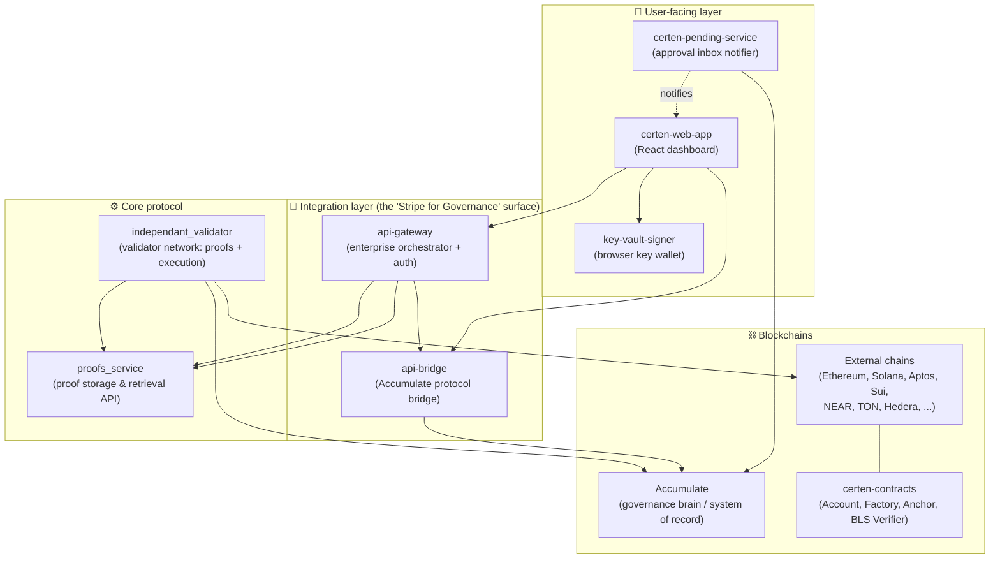

# Certen — Founder's Guide to the Whole System

> **Status note (read me):** Certen is on **testnets** today (Ethereum Sepolia,
> Solana Devnet, Cardano Preview, and others). All blockchain addresses in these
> docs are testnet addresses and they **change as we upgrade contracts**.

---

## 1. The one-paragraph version

Certen lets an organization make a decision **once**, in one trusted place
(the **Accumulate** blockchain, which acts as the company's "governance brain"
and system of record), and then have that decision **carried out and proven**
across many other blockchains (Ethereum, Solana, Aptos, Sui, NEAR, TON, and more).
A network of **Certen validator nodes** watches Accumulate, packages each
approved decision into a tamper-proof **cryptographic proof**, executes the action
on the target chain through **Certen smart contracts**, and writes a receipt back
to Accumulate. The result: a multi-chain action that **anyone can independently
verify happened correctly**, without trusting Certen, any single validator, or
any middleman.

---

## 2. The mental model (analogy)

Think of Certen as a **certified, multi-country courier and notary service** for
corporate decisions:

| Real-world analogy | Certen component | What it is |
|---|---|---|
| The boardroom + the official minute book | **Accumulate** (governance brain & system of record) | Where decisions are authorized and permanently recorded |
| The decision / signed resolution | **Intent** | A transaction on Accumulate that says "do X on chain Y" |
| The bonded courier network | **Independent Validators** | Nodes that watch Accumulate, prove the decision, and execute it elsewhere |
| Certified-mail receipts anyone can check | **Proofs** | Cryptographic evidence the decision was real, authorized, and executed |
| Lockboxes in each country that only open with a valid receipt | **Certen smart contracts** (Account, Factory, Anchor, BLS Verifier) | On-chain code that executes the action only when shown a valid proof |
| The corporate banking app | **Web App** | Where users see identities, approvals, history, and proofs |
| The hardware key / wallet | **Key Vault Signer** | Browser extension that holds private keys and signs approvals |
| The "you have something to sign" inbox | **Pending Service** | Watches for approvals you owe and notifies you |
| The Stripe-style API for partners | **API Gateway / API Bridge** | How enterprises and the app talk to the whole system |

---

## 3. The eight repositories at a glance

| Repo | Plain-English job | Tech |
|---|---|---|
| **independant_validator** | The heart of the network. Validator nodes that watch Accumulate, build proofs, run consensus among themselves, execute actions on external chains, and write results back. | Go, CometBFT |
| **proofs_service** | The library/archive. Stores every proof and serves it over an API so customers and auditors can fetch and verify them. | Go, PostgreSQL, React explorer |
| **certen-contracts** | The on-chain code deployed to every external chain: smart **Accounts**, the **Factory** that creates them, the **Anchor** that records & checks proofs, and the **BLS Verifier** that checks validator signatures cheaply. | Solidity (EVM) + Move/Rust/etc. for non-EVM |
| **api-bridge** | Low-level translator between a normal REST API and the Accumulate blockchain. Also deploys accounts on the 13 chains. | Node.js / Express |
| **api-gateway** | The enterprise front door. Multi-tenant, API-key auth, webhooks, signing providers (AWS KMS, Vault…), audit logs. Orchestrates the other services. | Node.js / Fastify, PostgreSQL |
| **certen-pending-service** | Background watcher that figures out "who needs to sign what" and pushes that to users' inboxes. | Node.js, Firestore |
| **certen-web-app** | The dashboard users actually click around in: identities, approvals, chains, proofs. | React |
| **key-vault-signer** | A browser extension that securely stores private keys and signs approvals. Keys never leave the extension. | Chrome Extension (MV3), React |

---

## 4. Where to go next

These documents cover the system end to end — the first six are *how it works*,
the seventh is *how to think about and sell it*:

1. **[01 — Infrastructure & Workflow Diagrams](./01-infrastructure-and-workflows.md)**
   Visual maps of the full system and how data flows.
2. **[02 — External Chains & their relationship to Accumulate](./02-external-chains-and-accumulate.md)**
   Which chains, which addresses, and exactly how they connect to Accumulate.
3. **[03 — End-to-End Workflows](./03-end-to-end-workflows.md)**
   Every major capability, walked through step by step.
4. **[04 — Proof Types & their Parts](./04-proof-types-and-parts.md)**
   What a "proof" actually contains, layer by layer.
5. **[05 — How Proofs Are Used (where & when)](./05-how-proofs-are-used.md)**
   The life of a proof from creation to verification.
6. **[06 — The Smart Contracts Explained](./06-contracts-explained.md)**
   Account, Account Factory, BLS/ZK Verifier, and Anchor — what each does and how.
7. **[07 — Possible Framing, and Monetization Paths](./07-positioning-and-monetization.md)**
   The dev team's perspective on what we've built and a few directions it might
   point — input for the business side, not a plan.

Then, a companion set on the step *before* a decision is carried out — how the
decision gets made, and how it can be made by software the customer owns:

8. **[The Policy Engine Layer](./policy-engine/README.md)**
   How an organization's own off-chain policy engine — its fraud rules, spending
   limits, compliance checks, human approvals — becomes a cryptographically
   binding gate on Certen, without those rules ever leaving their infrastructure.

---

## 5. Mini-glossary (keep this handy)

| Term | Plain meaning |
|---|---|
| **Accumulate** | A blockchain purpose-built for identity & governance. Certen uses it as the trusted "decision book." |
| **ADI** (Accumulate Digital Identity) | A named on-chain identity, like `acc://acme.acme`. Think "the company's account name." |
| **Key Book / Key Page** | Accumulate's permission system. A key page lists who can sign and how many signatures are required (e.g. "3 of 5"). |
| **Intent** | A request recorded on Accumulate to perform an action on another chain ("send 100 tokens on Ethereum"). |
| **Validator** | A Certen node. The network needs a supermajority (2/3+) of honest validators to agree. |
| **Consensus (BFT / CometBFT)** | The voting process validators use to agree on the truth even if some are faulty or malicious. |
| **Proof** | Cryptographic evidence. Math, not trust — anyone can re-check it. |
| **Anchor** | (1) The act of recording a proof's fingerprint on an external chain; (2) the smart contract that does it. |
| **app_hash / BPT root** | Accumulate's one-number summary of all account states at a moment in time. A proof ties back to this. |
| **Merkle proof** | A compact way to prove "this item is inside this big set" using a chain of hashes. |
| **BLS signature** | A signature scheme that lets many validators' signatures be combined into one small signature — efficient to check on-chain. |
| **ZK-SNARK / Groth16** | A way to prove "I checked all those signatures and they're valid" with a tiny, cheap-to-verify proof. |
| **G0 / G1 / G2** | The three **governance** proof levels: was it included, was it authorized, did the outcome match. |
| **L1–L4** | The **consensus/state** proof layers: account state → block → validator signatures → genesis trust. |
| **on-demand vs on-cadence** | Two proof speeds: immediate (premium) vs batched every ~15 min (cheaper, amortized). |
