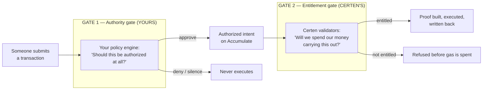
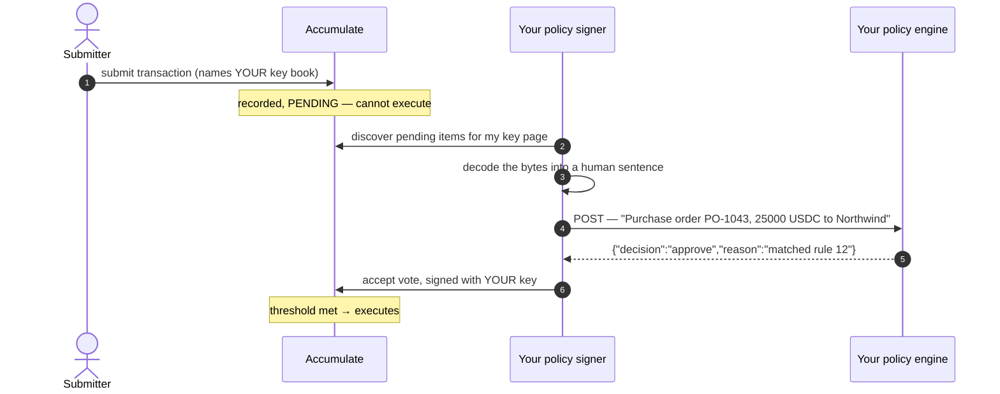
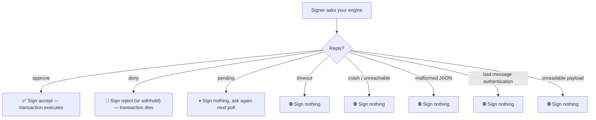
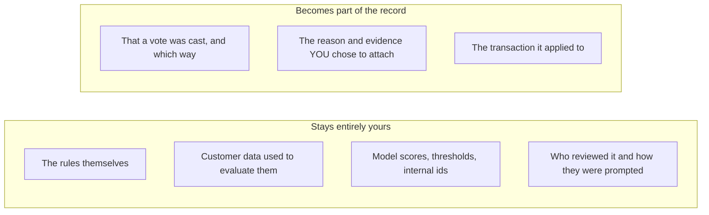

# 01 — What the Policy Gate Is (and Why There Are Two)

[← Back to index](./README.md)

Certen has **two independent gates**, and they answer different questions for
different parties. Conflating them is the single most common misconception about
the system, so this document separates them first and explains each after.

---

## 1. The two gates at a glance

| | **Gate 1 — Authority** | **Gate 2 — Entitlement** |
|---|---|---|
| Asks | "Is this decision permitted under *your* rules?" | "Is this account in good standing to have *Certen* spend on it?" |
| Owned by | **You** | **Certen** |
| Runs where | Your infrastructure, off chain | Inside the Certen validator network's consensus |
| Enforced by | Accumulate's own authority rules — the transaction cannot execute without your signature | Certen's `ValidatorBlock` invariants — an unentitled block cannot commit on any node |
| Failure mode | Withholds a signature. Transaction stalls, then expires. | Rejects the block. No proof, no gas. |
| Concerned with | Fraud, limits, compliance, human approval | Billing and account standing |

They are genuinely independent. Your engine approving something does not oblige
Certen to pay for it, and Certen's billing status has no bearing on whether your
rules permit the action. **This document is about Gate 1.** Gate 2 exists in this
document only so you can tell them apart; it is covered in the billing material.

> **Status, stated honestly:** Gate 1 is live and is the supported integration
> path. Gate 2's validator-side enforcement ships with its mode defaulting to
> **off** — turning it on is a deliberate, coordinated operator action across the
> whole fleet, because a network where some nodes enforce a consensus rule and
> others do not is a network that disagrees about block validity.

---

## 2. Why the authority gate is enforceable at all

The gate is not a convention, a middleware layer, or a Certen policy. It is a
property of how Accumulate handles authority.

When a transaction is submitted naming your **key book** as a required authority,
Accumulate itself holds that transaction **pending**. It is recorded, it is
public, and it is inert. No amount of cooperation between Certen, the submitter,
and every validator on the network can make it execute. The only thing that moves
it is a signature from a key on your key page.

This is why the integration requires **no change to how transactions are built**.
The gate attaches to the identity, not to the payload format or the submitting
application.

---

## 3. What "fail-closed" actually means here

Every branch that is not an explicit approval withholds the signature:

The founder-relevant consequence:

> **An outage cannot approve anything.** Taking your policy endpoint down —
> including an attacker doing so — stalls transactions. It never releases a
> signature. Denial of service against this system produces inaction, not
> unauthorized action.

There is a real tradeoff on the other side of that, and it should be stated
plainly rather than buried: a stalled transaction stays pending until it expires
on chain. If you want a failed check to *kill* a transaction rather than park it,
your engine must return an explicit `deny`. Failing loudly and failing closed are
different behaviours, and the choice is yours to make deliberately.

---

## 4. Why the decision has to happen off chain

A reasonable question from anyone seeing this for the first time: if Certen is a
governance protocol, why are the rules not *in* the protocol?

Because the interesting decisions depend on facts a blockchain cannot see.

| Decision your engine can make | Why a chain cannot make it |
|---|---|
| "This device just failed biometric re-auth" | The chain has no access to your identity provider |
| "This counterparty was sanctioned this morning" | The list lives in a commercial data feed |
| "This is the fourth transfer this hour from a dormant account" | Requires your behavioural history, not chain state |
| "The CFO has not clicked approve yet" | Requires your review queue and your notion of who the CFO is |
| "This exceeds the limit in the contract we signed in March" | The contract is a document, not on-chain state |

Putting these on chain would mean publishing your fraud model, your customer
data, and your commercial terms. The design keeps them where they belong and
makes only the **outcome** — approved or not, plus whatever evidence you choose
to attach — cryptographically binding.

That is the trade the policy layer exists to make: **private reasoning, public
accountability.**

---

## 5. What Certen sees, and what it does not

Your engine receives a description of a pending transaction and returns a
decision. Certen's validators never call your engine, never see your rules, and
cannot sign on your behalf. What they eventually see is what Accumulate sees:
that the required authority signed, which is exactly what makes the intent
authorized.

The `reason` and `evidence` fields are yours to populate and are stored
**verbatim**. Put in what an auditor will need — rule ids, match scores, reviewer
identity, ticket numbers — and leave out what they should not have. Nothing
inspects those fields; they are carried, not interpreted.

---

## 6. The one Accumulate detail that surprises people

Worth knowing because it shapes what is possible:

> **The vote is fixed at the moment the signing data is created.** Accumulate
> folds the vote into the signature metadata hash, so *approve* and *reject* are
> two different things to sign — not one thing with a flag attached.

The consequence is a good one: a signing backend cannot produce a signature first
and decide its meaning afterwards. A signature that says "approve" was
constructed, from the beginning, to say approve. There is no path where an
approval is manufactured by reinterpreting bytes that were signed for another
purpose.

---

Continue to **[02 — How your engine participates →](./02-how-your-engine-participates.md)**
