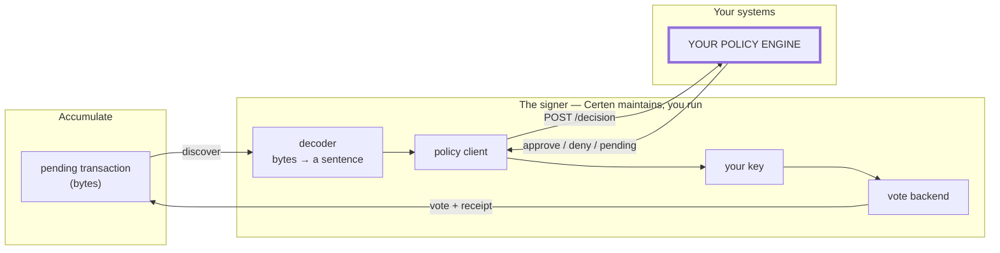
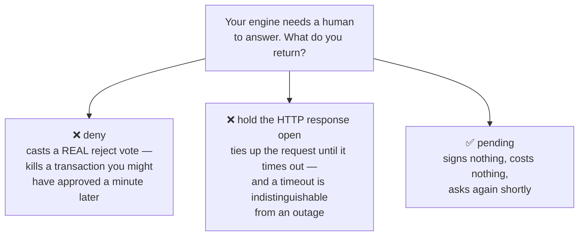
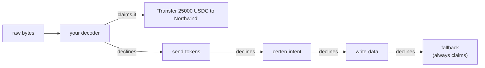
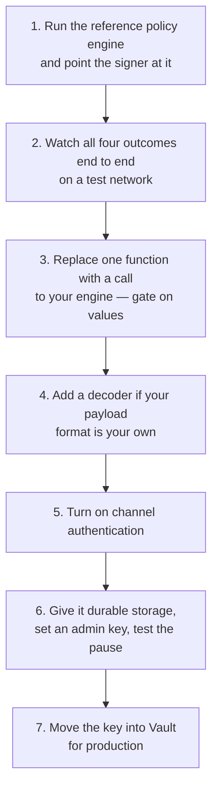

# 02 — How Your Engine Participates

[← Back to index](./README.md)

The previous document explained *why* the gate exists. This one explains *what
you actually build*. The short answer: **one HTTP endpoint.** Everything else on
this page is optional.

---

## 1. The whole integration, in one picture



Three seams are configurable. Most integrations use only the first, and none of
them require forking Certen's code:

| Seam | Decides | How you change it |
|---|---|---|
| **1. Policy engine** | Whether to sign | Point config at your HTTPS endpoint |
| **2. Intent decoder** | What your engine is *shown* | Supply a small module, loaded at boot |
| **3. Vote backend** | How the vote reaches the chain | Default is direct-to-Accumulate; rarely changed |

---

## 2. Seam 1 — the decision (this is the integration)

One HTTP POST per pending transaction. The signer has no opinion about what
computes the answer: a rules engine, a fraud model, a review queue, a human with
a button, or a call to the approvals service you already run.

### What you receive

```jsonc
{
  "requestId":     "a7f3…",           // unique PER REQUEST — regenerated every poll
  "txHash":        "9c2b…",           // the transaction — STABLE for its lifetime
  "operationId":   "PO-1043",         // your own id, if your payload carried one
  "account":       "acc://acme.acme/orders",
  "chain":         "ethereum",
  "actionSummary": "Purchase order PO-1043 — 25000 USDC to Northwind",
  "target":        "0xabc…",
  "value":         "25000",           // FIRST amount only — for display
  "values":        ["25000", "500"],  // EVERY amount — gate on these
  "expiresAt":     "2026-07-26T12:00:00Z"
}
```

### What you return

```jsonc
{
  "decision": "approve" | "deny" | "pending",   // the only required field
  "reason":   "matched rule 12",                 // optional → stored in the receipt
  "evidence": { "score": 0.98, "reviewer": "…" } // optional, any JSON → stored verbatim
}
```

That is the entire contract. One field is mandatory.

### Two traps worth knowing before you write the code

Both of these are the kind of mistake that works fine in testing and fails in a
way nobody notices in production.

> **① Gate on `values`, not `value`.**
> A transaction can move value in several legs. `value` is only the first one,
> carried for display. Check it alone and the rest are ungated — an amount over
> your limit can ride along beside one under it.

> **② Key your state on `txHash`, never on `requestId`.**
> `requestId` is regenerated on every poll; `txHash` is stable for the life of
> the transaction. Keyed on `requestId`, a human-approval flow opens a brand new
> challenge every poll — texting your user a fresh prompt every twenty seconds.

---

## 3. The four outcomes

| Reply | What happens |
|---|---|
| `approve` | Casts an **accept** vote with your key. The transaction executes. |
| `deny` | Casts a **reject** vote (or withholds, configurable). The transaction dies. |
| `pending` | **Signs nothing.** Leaves it pending on chain and asks again next poll. |
| anything else | **Signs nothing**, retries. Covers non-2xx, non-JSON, unknown decision, timeout, unreachable host, failed authentication. |

### `pending` is the one people underuse

If your decision needs a human, a step-up challenge, or a review queue, return
`pending`. The signer withholds and re-asks on its poll interval, indefinitely.
It costs nothing and is not recorded as an error.

The alternatives are worse, and it is worth knowing why:



---

## 4. Seam 2 — the decoder (what your engine is shown)

A pending transaction is bytes. Something must turn them into that
`actionSummary` sentence and that `values` array before a policy decision means
anything — and **your payload format is yours**, so this is the one translation
Certen cannot ship for you.

You do not fork anything. You point config at a module, and it is loaded at boot.



Three rules, in order of how much trouble ignoring them causes:

1. **Decline rather than guess.** Return "not mine" whenever unsure. A wrong
   summary is far worse than no summary: your engine would approve a description
   that is *not* the transaction about to be signed — and that approval produces
   a real signature over the real bytes. A declined transaction still reaches
   your engine, described generically, and can still be denied.
2. **Put every amount in `values`.** Same reason as §2.
3. **Prefer your own id as `operationId`.** It survives a re-submission in a way
   a transaction hash does not, so it is what you can reconcile against your own
   records.

**Order matters — first claim wins.** A specific decoder must run ahead of a
general one. The signer logs its whole decoder chain at startup; confirm yours
is in it, because the failure mode is quiet — transactions simply start arriving
at your engine described as "Unrecognized data write".

---

## 5. Seam 3 — how the vote reaches the chain

Default is **direct**: the signer builds the Accumulate signature itself and
submits to a node. Self-contained, nothing else need exist, and most deployments
never touch this.

An optional adapter votes through Certen's api-gateway instead. Even then **your
key never leaves your process** — the gateway computes what must be signed, hands
over the bytes, and you decide whether to sign them. Discovery and decoding stay
local either way.

---

## 6. Authenticating the channel

An unauthenticated decision channel means anything that can reach the signer's
outbound path can authorize a signature. Outside a trusted network, turn on
message authentication: the signer signs its request and **requires** a valid
signature on your response, with a five-minute freshness window bounding replay.

> **Sign the exact bytes you send.** The signer verifies the raw response body,
> not a re-parse of it. An engine that signs a re-serialized copy — pretty-printed
> JSON, or Python's `json.dumps` spacing — fails authentication forever. And
> because a failed authentication is a policy failure, the signer would then
> correctly, silently, never sign again.

That is fail-closed working as designed, and it is also the single most likely
way to discover it during integration. The shipped reference engine does this
correctly; start from it.

---

## 7. What you get without configuring anything

| Guarantee | Why it matters |
|---|---|
| **Never votes twice** | Signing history is idempotent and survives restart, so a crash cannot double-vote |
| **A receipt per decision** | Your `reason` and `evidence`, stored verbatim beside the transaction hash and the vote |
| **Emergency stop** | One admin call halts all signing immediately — including reject votes, because a reject is still a signature |
| **A local value ceiling** | Every amount gated as a big integer, as defence-in-depth *behind* your engine. A backstop for an engine bug, not a policy |
| **Health and metrics** | Poller liveness and decision counts, authenticated by default |

---

## 8. The integration path, in order



Steps 1 and 2 need no blockchain and no key. The realistic first milestone is
watching an *engine outage* stall a transaction rather than release it — that is
the property the whole design exists to provide, and it is worth seeing with your
own eyes before writing any integration code.

---

Continue to **[03 — From your decision to a verifiable proof →](./03-from-decision-to-proof.md)**
