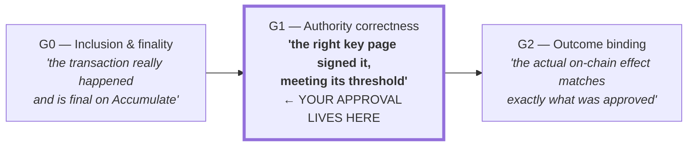
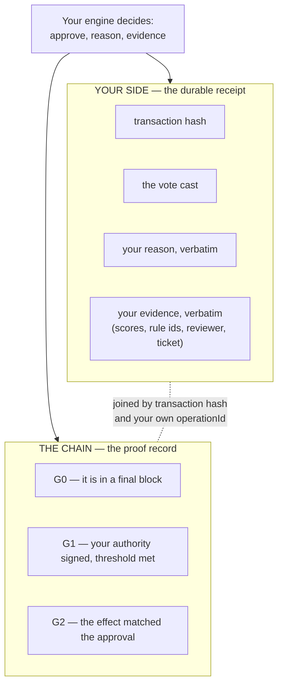
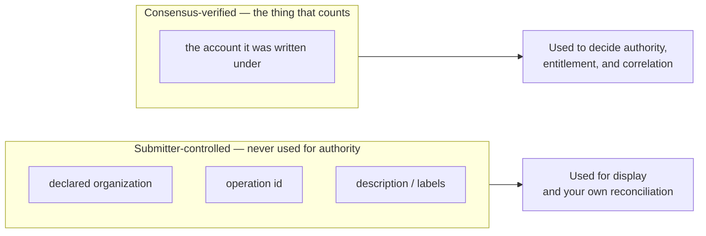
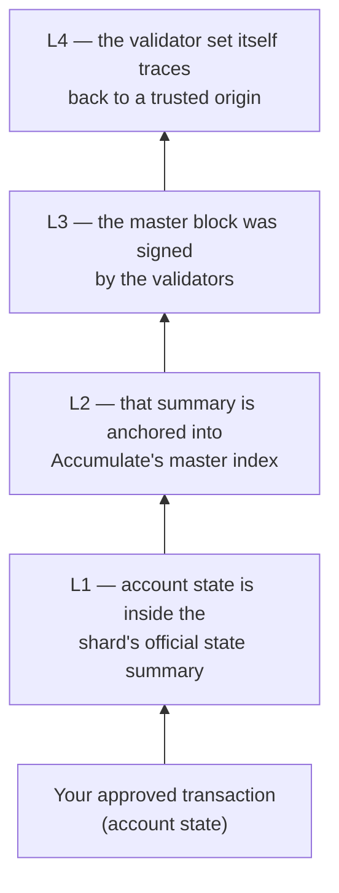
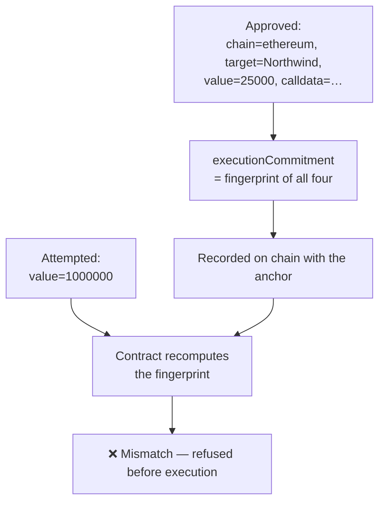
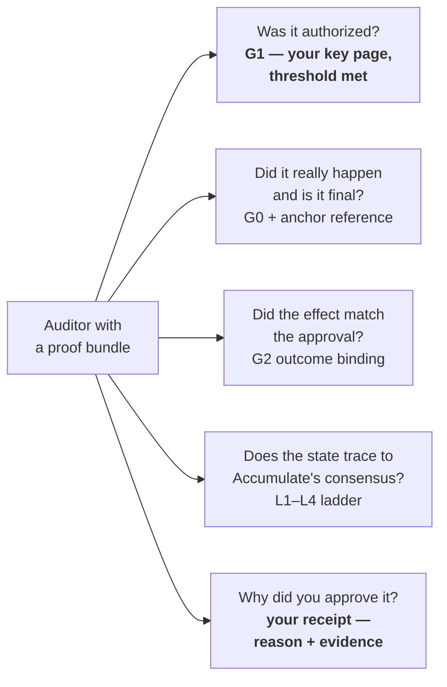

# 03 — From Your Decision to a Verifiable Proof

[← Back to index](./README.md)

Your engine returned `approve`. This document follows what happens to that
decision afterwards — how a private judgement made on your own hardware becomes
part of a proof that a regulator, a counterparty, or an auditor can re-check
years later without trusting you, Certen, or any validator.

This is where the policy layer meets the proof machinery described in
[04 — Proof Types & their Parts](../04-proof-types-and-parts.md) and
[05 — How Proofs Are Used](../05-how-proofs-are-used.md).

---

## 1. Your approval is the G1 layer

Certen's governance proof has three levels. Your decision **is** the middle one.

When an auditor later verifies G1, what they are checking is precisely the thing
your engine controlled: that the authority named on the transaction really did
sign it, that the signing key was genuinely on that key page at that moment, and
that the required threshold was met.

The property that makes this worth something: **G1 cannot be satisfied by
cooperation.** No combination of Certen, the submitter, and the validator network
can produce a valid G1 for a transaction your key never signed. That is not a
promise about conduct; it is what the mathematics permits.

---

## 2. The two halves of the audit trail

Your decision produces evidence in two places, and they are designed to be joined
later.

| | Your receipt | The on-chain proof |
|---|---|---|
| Holds | *Why* you decided | *That* you decided, and what followed |
| Lives | Your storage, your control | Accumulate, and anchored onto external chains |
| Readable by | You, and whoever you show it to | Anyone, forever |
| Answers | "What was our reasoning?" | "Was this legitimately authorized and correctly executed?" |

Neither half is sufficient alone, which is the point. The chain proves the
approval was real and binding but knows nothing about your rules. Your receipt
explains the reasoning but is a document you control, and a document you control
proves nothing to a sceptic. **Together they are an audit trail that runs from
"we decided this, for this reason" to "this provably happened."**

This is also why `reason` and `evidence` are stored verbatim and never
interpreted. They are your side of a join, and their value depends entirely on
you putting something reconcilable in them.

---

## 3. Why the account URL is the anchor of trust

A detail that matters more than it appears. Almost everything a transaction
carries is supplied by whoever submitted it — a declared originating identity, an
operation id, a description. Any of it can be set to anything.

**One field cannot be.** The account the transaction was actually written under
is verified by Accumulate's own consensus before the transaction exists at all:
the submitter had to prove they could sign for it. Certen's pipeline treats that
field as the only trustworthy identifier and deliberately **overwrites** the
self-declared identity with it.

For your engine, the practical consequence is: treat `account` as identity and
`operationId` as a convenience for matching your own records. Do not build a
security decision on a field the submitter chose.

---

## 4. Riding the ladder: how a proof stays checkable

Your approval is now part of Accumulate's state. The **chained proof** ties that
state, layer by layer, back to Accumulate's consensus — so that verifying your
approval does not require trusting any server that reports it.

Each layer is cryptographically linked to the next. Faking any single link breaks
the chain, so an intermediate step cannot be forged without the whole thing
failing verification. That is what lets an auditor start from a published root
and arrive at *your specific approval* with no trusted intermediary anywhere in
the path.

> **Status, stated honestly.** L1–L3 are live and enforced. The **L4 consensus
> binding is live and fail-closed today** — a proof that does not tie back to
> Accumulate's consensus is rejected outright, not downgraded. The remaining
> piece of L4, the *full* genesis-to-now validator-set proof with per-signature
> and voting-power checks, depends on capabilities the current Accumulate mainnet
> does not yet expose to lite clients. Certen is working directly with the
> Accumulate core developers to add that at the protocol level. The accurate
> one-liner: **L1–L3 done; L4 binding live and fail-closed; the full L4
> validator-set proof in progress with Accumulate core.**
>
> What this means for you today: the binding your approval depends on is
> enforced. The part still in progress would strengthen how a verifier
> establishes *which validator set* was legitimate at a given moment — it does
> not weaken the guarantee that your key, and only your key, authorized the
> action.

---

## 5. Outcome binding — why an approval cannot be repurposed

The concern a careful reader arrives at next: your engine approved "25,000 USDC
to Northwind." What stops that approval being used to send 1,000,000 to someone
else?

**G2 outcome binding**, enforced on the external chain before anything executes.
The contract recomputes a fingerprint over the exact chain, target, value and
call data, and demands it match what the proof committed to.

The same mechanism refuses a proof replayed on a different chain, replayed for a
second execution, or presented after its window closed. So the guarantee your
engine's approval carries is narrower and stronger than "this party may transact":
it is **this exact action, on this chain, once.**

---

## 6. What an auditor can establish, end to end

Four of those five are answerable by anyone, from the bundle alone, using
mathematics. The fifth is the one you hold — and it is the only one that needs to
be, because it is the only one about your reasoning rather than about what
happened.

For founders, that split is the product story in a sentence: **Certen makes your
governance decisions provable without making them public.**

---

Continue to **[04 — Assurance, custody, and operating it →](./04-assurance-and-operations.md)**
