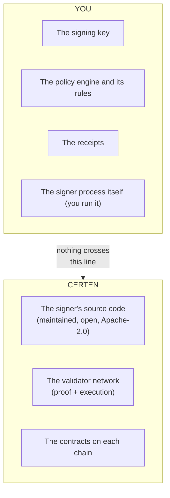
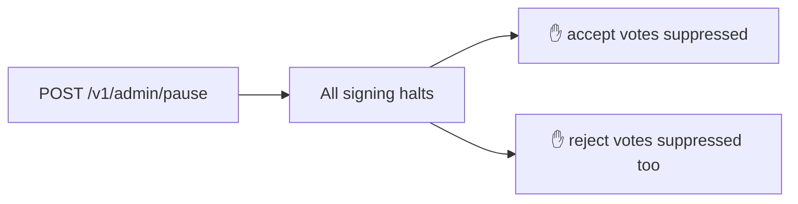
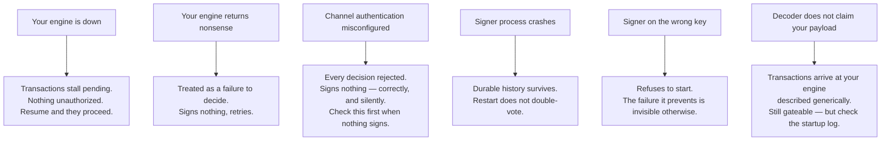
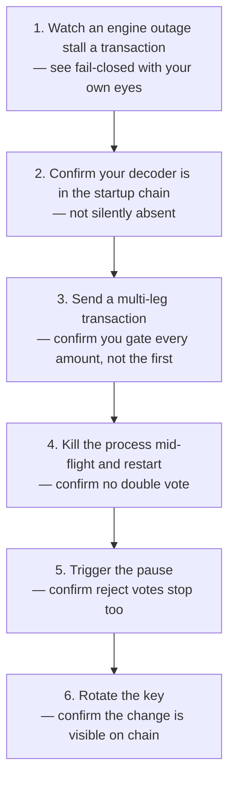

# 04 — Assurance, Custody, and Operating It

[← Back to index](./README.md)

The previous documents described what the policy layer does. This one is for the
question that follows: **why should anyone believe it?** It covers who holds the
key, which guarantees are structural versus configured, and what to verify before
trusting the thing in production.

---

## 1. Who holds what

**This software is not custodial.** The key is generated and held by you. Certen
cannot sign with it, cannot compel a signature, and does not operate the process
that holds it. What Certen provides is the code, maintained in the open, that you
run on your own infrastructure.

Two custody postures:

| Posture | Where the key lives | When to use it |
|---|---|---|
| **Vault** | Generated inside HashiCorp Vault and never leaves it; Vault performs the signature. The signer process never holds private key material. | Production |
| **Local** | Held in the signer's memory, injected from a secret reference or mounted file. | Pilots — a deliberate, documented tradeoff |

The path from one to the other is a supported operation, not a rebuild.

---

## 2. Structural guarantees versus configured ones

The distinction that matters when assessing risk: some properties hold because of
how the code is written, and some hold because someone set them correctly.

### Structural — true regardless of configuration

| Guarantee | Why it holds |
|---|---|
| **Nothing is signed without an explicit `approve`** | Every other branch — timeout, crash, malformed reply, failed authentication, unreadable payload — returns without signing. There is no code path from silence to a signature. |
| **An outage cannot approve anything** | Same reason. Denial of service produces inaction. |
| **A vote's meaning is fixed when it is signed** | Accumulate folds the vote into what gets signed. Approve and reject are different preimages, so no backend can sign first and choose the meaning after. |
| **Refuses to boot on an unusable key configuration** | Rather than generating a random key and casting votes the network will silently reject. |
| **Refuses to boot if the configured key is not verifiably on the on-chain key page** | Prevents the quiet failure: a signer on the wrong key looks perfectly healthy while every vote it casts is rejected and nothing it does takes effect. |
| **Admin routes are authenticated or they return 403** | Protection comes from the credential, not from a bind address. Credentials are compared in constant time. |

### Configured — you have to set these

| Setting | What goes wrong without it |
|---|---|
| **Durable storage path** | Signing history and receipts die with the process. A restart can double-vote, and the audit trail is lost. |
| **Channel authentication** | Anything that can reach the signer's outbound path can authorize a signature. |
| **Admin credential** | Admin routes stay closed (403), so the emergency pause is unavailable when you need it. |
| **Value ceiling** *(optional)* | No local backstop behind an engine bug. |

The honest framing for a risk review: the first table is what you get from
choosing this design; the second is what you owe it. Neither substitutes for the
other.

---

## 3. The value ceiling is a backstop, not a policy

Worth being precise, because it is easy to mistake for a control.

The ceiling refuses to sign if **any** amount exceeds it, compared as an exact
big integer. It exists to catch a bug in your engine — a rule that misfires, a
unit conversion that goes wrong — and nothing else. Your engine remains the
policy; this is defence in depth behind it.

> The big-integer comparison is deliberate. At the scale blockchain amounts use,
> ordinary floating-point number handling silently rounds, and a rounded
> comparison would wave an over-limit amount straight through. The check is only
> worth having if it is exact.

---

## 4. The emergency stop

One authenticated call halts all signing immediately.

The second branch is the design decision worth understanding: **a reject is still
a signature.** If you have paused because you do not trust what the system is
doing, you do not want it continuing to cast reject votes that permanently kill
transactions. Pause means pause.

Verify it works before you need it. An untested emergency control is not a
control.

---

## 5. Failure modes, and what each one looks like

The pattern across every row: **the system degrades toward inaction.** That is the
intended shape, and it has a cost worth stating — a policy layer that fails
closed will, at some point, stall legitimate business because something in your
own infrastructure was unavailable. Operating it well means monitoring the
stalls, not just the denials.

The item most likely to bite during integration is the third one. A failed
message authentication is a policy failure, and a policy failure withholds — so a
misconfigured channel produces a signer that looks healthy and never signs
anything. Check it first.

---

## 6. What to verify before trusting it

A short list, roughly in the order a sceptical reviewer would ask:

Steps 1–3 need no blockchain and no key material. They are also the three that
catch the mistakes that matter most, which is why they come first.

---

## 7. What this layer does not claim

Stated plainly, because a security story with no boundaries is not a security
story:

- **It does not make your rules correct.** If your engine approves something it
  should not have, the system will faithfully, provably, and permanently record
  that you approved it. Certen makes decisions binding, not wise.
- **It does not protect a compromised key.** An attacker holding your signing key
  and able to reach the vote path can sign. Custody in Vault raises that bar;
  it does not remove it.
- **It does not prevent stalling.** Anyone who can take down your policy endpoint
  can stop transactions from executing. This is the deliberate trade — it is the
  same property that stops an outage from approving anything.
- **It does not decide whether Certen will pay to execute.** That is the separate
  entitlement gate ([01 §1](./01-what-the-policy-gate-is.md#1-the-two-gates-at-a-glance)),
  and it answers a different question.
- **It is not a replacement for on-chain authority design.** The gate is only as
  meaningful as the key book that names it. If your key page threshold is 1-of-many
  and the other keys are loosely held, the policy gate is one signature among
  several.

---

## 8. Where to go from here

| You want | Go to |
|---|---|
| The API contract, config schema, deploy topology | `certen-headless-offchain-policy-engine-signer/docs/` |
| Key rotation, cutover, backup, upgrades | `OPERATIONS.md` in that repo |
| Custody postures and the threat model | `DEPLOY.md` in that repo |
| What a proof contains | [04 — Proof Types & their Parts](../04-proof-types-and-parts.md) |
| Where proofs are used and by whom | [05 — How Proofs Are Used](../05-how-proofs-are-used.md) |
| The contracts that enforce outcome binding | [06 — The Smart Contracts Explained](../06-contracts-explained.md) |

---

[← Back to index](./README.md)
