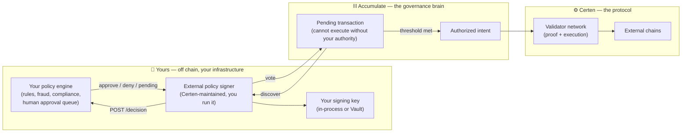

# Certen — The Policy Engine Layer

> **Status note (read me):** Certen is on **testnets** today. Addresses change as
> contracts are upgraded. Where a capability is partially live, these documents
> say so explicitly rather than rounding up.

[← Back to the Founder's Guide](../README.md)

---

## 1. The one-paragraph version

The [Founder's Guide](../README.md) explains how Certen carries a decision across
chains and proves it happened. These documents explain the step *before* that:
**how the decision gets made, and how it can be made by software you own.**

Certen does not ask you to move your rules onto a blockchain. Your fraud model,
your spending limits, your compliance checks, your human approval queue — those
stay exactly where they are, running on your infrastructure, under your control.
What Certen adds is a way to make those rules **cryptographically binding**: a
transaction that your engine has not approved cannot execute, and the approval it
gives becomes a permanent, independently verifiable part of the proof record.

The component that does this is the **external policy signer** — a small service
you run, holding a key only you control, that asks your engine for a decision and
signs only on an explicit *approve*.

---

## 2. The mental model (analogy)

The Founder's Guide compared Certen to a certified courier and notary service.
The policy layer is the part of that service where **you** are the authorizing
officer:

| Real-world analogy | Certen component | What it is |
|---|---|---|
| A cheque that needs the treasurer's counter-signature | **Pending transaction with your key book as required authority** | It physically cannot clear without you |
| The treasurer's own rulebook (limits, checks, escalation) | **Your off-chain policy engine** | Your existing systems — unchanged, on your hardware |
| The treasurer's pen, locked in their own drawer | **Your signing key** (in-process or in HashiCorp Vault) | Certen never holds it and cannot use it |
| The clerk who brings the cheque and applies the pen when told | **The external policy signer** | Software Certen maintains, that you run |
| The note in the ledger margin: *"approved, rule 12, ticket #4417"* | **The durable receipt** | Your reason and evidence, stored verbatim beside the vote |

The important property of that analogy: **if the treasurer is unreachable, the
cheque does not clear.** It does not clear "by default" after a timeout. Silence
is never approval.

---

## 3. Where policy sits in the whole system

Two things worth noticing in that diagram:

1. **Your engine never talks to a blockchain.** It answers one HTTP request with
   one JSON field. Everything chain-shaped is the signer's job.
2. **The gate is upstream of everything Certen does.** If your engine says no,
   there is no authorized intent, so there is no proof to build and no gas to
   spend. The refusal costs nothing.

---

## 4. Where to go next

1. **[01 — What the policy gate is (and the two gates)](./01-what-the-policy-gate-is.md)**
   Certen has *two* independent gates. Knowing which is which prevents the most
   common misconception about the system.
2. **[02 — How your engine participates](./02-how-your-engine-participates.md)**
   The actual integration: one HTTP endpoint, four outcomes, three optional seams.
3. **[03 — From your decision to a verifiable proof](./03-from-decision-to-proof.md)**
   What happens to your *approve* afterwards — how it becomes G1 authority
   evidence and rides the L1–L4 ladder into something an auditor can re-check.
4. **[04 — Assurance, custody, and operating it](./04-assurance-and-operations.md)**
   Why "fail-closed" is a property of the code rather than a setting, who holds
   the key, and what to verify before you trust it.

Engineering-level reference — the API contract, config schema, deploy topology —
lives with the component itself in
`certen-headless-offchain-policy-engine-signer/docs/`. These documents are the
*why* and the *shape*; that repo is the *how*.

---

## 5. Mini-glossary (additions to the main guide)

| Term | Plain meaning |
|---|---|
| **Off-chain policy engine** | Your software that decides approve/deny. Certen neither ships nor hosts it. |
| **External policy signer** | The Certen-maintained service you run that asks your engine and holds your key. |
| **Key book / key page** | Accumulate's permission structure. Naming your key book on a transaction is what makes your approval mandatory. |
| **Pending transaction** | A transaction recorded on Accumulate that cannot execute until required authorities sign. |
| **Vote** | A signature carrying an accept or reject. In Accumulate the vote is baked into what gets signed — not a flag added afterwards. |
| **Fail-closed** | Every failure withholds the signature. An outage stalls work; it never releases it. |
| **Receipt** | The durable local record tying your `reason` and `evidence` to the transaction hash and the vote cast. |
| **Entitlement gate** | A *separate*, Certen-side gate deciding whether Certen will spend its own money on an intent. See [01](./01-what-the-policy-gate-is.md). |
